<h1 class="title toc-ignore display-3">
Making prettiness with ggplot2
</h1>
================
Danielle Navarro
4 December 2018

<!--

  html_document:
    includes:
      in_header: header.html
    theme: flatly
    highlight: textmate
    css: mystyle.css

-->
Visualising data is one of the most important tasks facing the data analyst. With that in mind, the structure of this chapter is as follows: I’ll start out by giving you a very quick overview of how graphics work in R. I’ll then discuss several different kinds of graph and how to draw them, as well as showing the basics of how to customise these plots. I’ll then talk in more detail about R graphics, discussing some of those complicated and boring issues.

``` r
library(here)
```

    ## here() starts at /Users/dan/GitHub/chdss2018/day2_dataanalysis

``` r
library(tidyverse)
```

    ## ── Attaching packages ──────────────────────────────────── tidyverse 1.2.1 ──

    ## ✔ ggplot2 3.0.0     ✔ purrr   0.2.5
    ## ✔ tibble  1.4.2     ✔ dplyr   0.7.6
    ## ✔ tidyr   0.8.1     ✔ stringr 1.3.1
    ## ✔ readr   1.1.1     ✔ forcats 0.3.0

    ## Warning: package 'dplyr' was built under R version 3.5.1

    ## ── Conflicts ─────────────────────────────────────── tidyverse_conflicts() ──
    ## ✖ dplyr::filter() masks stats::filter()
    ## ✖ dplyr::lag()    masks stats::lag()

R graphics
----------

Reduced to its simplest form, you can think of R graphics like a painting. You start out with an empty canvas. Every time you use a graphics function, it paints some new things onto your canvas. Later you can paint more things over the top if you want, layering new information over the old. This way of thinking about plotting data is referred to as the **painter’s model** - the key thing to keep in mind is because the plot is constructed sequentially, the order in which you do things matters.

We can extend the painting metaphor a little. If you want to paint a picture, you need to paint it on something. In real life, you can paint on lots of different things. Painting onto canvas isn’t the same as painting onto paper, and neither is the same as painting on a wall. In R, the thing that you paint onto is called a **graphics device**. In RStudio, the default graphics device is `RStudioGD` and it corresponds to the "plot" pane. If you were using the basic R program for Windows (i.e., `R.exe`) the default device is `windows`, on the Mac application (`R.app`) it’s called `quartz`, etc. However, from the computer's perspective there’s nothing terribly special about drawing pictures on screen, and so R is quite happy to paint pictures directly into a file. R can paint several different types of image files: `jpeg`, `png`, `pdf`, `postscript`, `tiff` and `bmp` files are all available as graphics devices and you can write plots directly to those using those[1]

Secondly, when you paint a picture you need to paint it with something. Maybe you want to do an oil painting, but maybe you want to use watercolour. And, generally speaking, you pretty much have to pick one or the other. The analog to this in R is a “graphics system”. A graphics system defines a collection of graphics commands about what to draw and where to draw it. Something that surprises most new R users is the discovery that R actually has several mutually incompatible graphics systems. The two of most interest to us are the **base graphics** system that comes with R and the **ggplot2** system[2] that forms part of **tidyverse**. There's quite a difference of opinion among R users about the relative merits of these two systems. You can get started in base graphics really easily. To see just how easy it is, let's load a new data set and try to draw a picture.

``` r
frames <- read_csv(here("analysis","data","frames_ex2.csv"))
frames
```

    ## # A tibble: 4,725 x 8
    ##       id gender   age condition sample_size n_obs test_item response
    ##    <int> <chr>  <int> <chr>     <chr>       <int>     <int>    <int>
    ##  1     1 male      36 category  small           2         1        8
    ##  2     1 male      36 category  small           2         2        7
    ##  3     1 male      36 category  small           2         3        6
    ##  4     1 male      36 category  small           2         4        6
    ##  5     1 male      36 category  small           2         5        5
    ##  6     1 male      36 category  small           2         6        6
    ##  7     1 male      36 category  small           2         7        3
    ##  8     1 male      36 category  medium          6         1        9
    ##  9     1 male      36 category  medium          6         2        7
    ## 10     1 male      36 category  medium          6         3        5
    ## # ... with 4,715 more rows

Using the tools from the last section, let's also create a smaller summary data frame that contains one row per person:

``` r
frames_small <- frames %>%
  group_by(id, gender, age, condition) %>%
  summarise(response = mean(response))
frames_small
```

    ## # A tibble: 225 x 5
    ## # Groups:   id, gender, age [?]
    ##       id gender   age condition response
    ##    <int> <chr>  <int> <chr>        <dbl>
    ##  1     1 male      36 category      5.33
    ##  2     2 male      46 category      7.05
    ##  3     3 female    33 property      4.86
    ##  4     4 female    71 property      3.86
    ##  5     5 female    23 property      9   
    ##  6     6 female    31 category      7.90
    ##  7     7 male      23 property      3.76
    ##  8     8 female    31 property      4   
    ##  9     9 female    37 category      3.38
    ## 10    10 female    46 category      5.86
    ## # ... with 215 more rows

Let's see if we can understand what's going on with this data set by drawing pictures, and also learn about R graphics in the process.

Histograms
----------

When analysing the data from this kind of experiment, one of the first things I check is that the `age` and `gender` variables are actually irrelevant. Honestly, I only bother to measure them at all because people seem to expect it in the literature but for the kind of questions I care about there's never any effects of age or gender. Still, you have to check just to make sure nothing weird is goind on.

With that in mind, let's give ourselves the task of drawing a histogram of the `age` variable in this data frame. We don't need to make it pretty, we just want to plot the frequency distribution for the number of points scored by the home team. As I mentioned earlier, we could do this using base graphics or we could do it the tidyverse way. Let's see how it plays out both ways.

The function to do this in base graphics is called `hist` and here it is:

``` r
hist(frames_small$age)
```

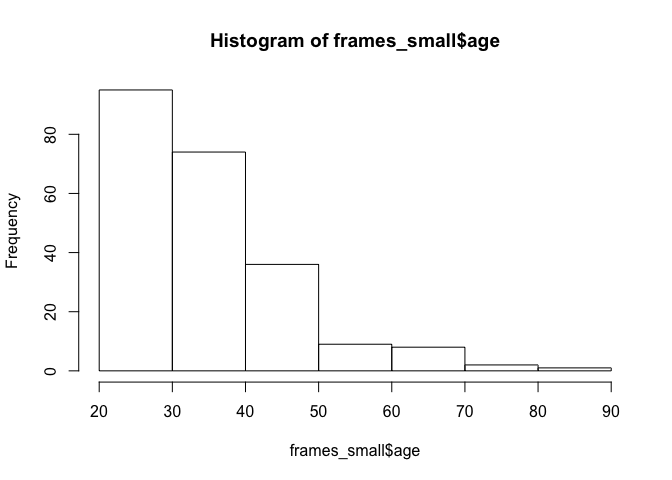 It's not exactly pretty -- though it's way nicer than the default plots that I remember seeing when I was younger -- but it gets the job done.

Okay, how do I create a histogram the tidyverse way? Much like base graphics, **ggplot2** recognises that histograms are such a fundamentally useful thing that there exists a "geom" (a term I'll explain in a moment) for them, but there's no way to draw a plot without going through a somewhat more convoluted process:

``` r
frames_small %>%
  ggplot(aes(x = age)) +
  geom_histogram()
```

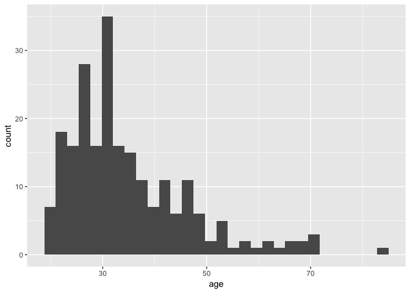 The output is prettier, admittedly, but our goal here wasn't to be pretty. Our goal was to be simple. For this comparison, the tidyverse approach is not as straightforward as base graphics.

Where the tidyverse versions shines is when we want to do something a little bit more complicated. Suppose I wanted two histograms side by side, plotting the age distribution separately by `condition`. In base graphics, it's a little cumbersome. What I have to do here is manually control the "layout" of the plot, dividing it into two separate panels and then drawing the histogram separately into each panel. That gives me code that looks like this:

``` r
layout(matrix(1:2, 1, 2))
hist(frames_small$age[frames$condition == "category"])
hist(frames_small$age[frames$condition == "property"])
```

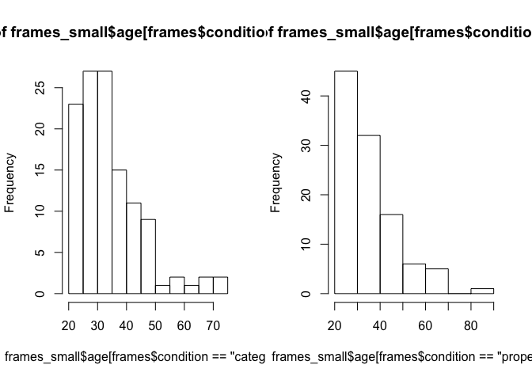

I need a lot more code as I did for the original version and I've ended up with an ugly plot. Of course, base graphics absolutely does allow me to do a better job than this, but I hope you can see that it will take quite a bit of effort to turn this into something readable.

What about the **ggplot2** version? It turns out that it's extremely easy. Splitting an existing plot into "facets" is a basic operation within **ggplot2** so all I need to do is add one line of code that specifies which variable to use to make the facets! The result is actually kind of nice:

``` r
frames_small %>%
  ggplot(aes(x = age)) +
  geom_histogram() +
  facet_wrap(~condition)
```

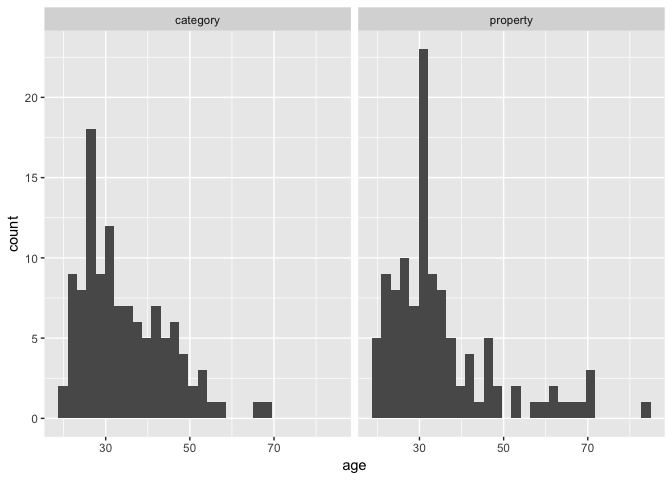

For me at least, this is the big advantage to the **ggplot2** approach. There's a certain amount of effort required to construct the basic plot, but once that is done, you can modify or manipulate that plot in an extremely flexible fashion with very little effort indeed. What I've found in practice is that the low-effort to making changes makes me much more willing to "play around" with different ways of visualising the data. So, while I'll admit that there are some situations where I resort to using base graphics (mostly when I have a very unconventional graph to draw), I tend to find the tidyverse approach works better in the majority of cases.

As far as what the data visualisation is telling us: the distribution of ages was mostly in the 20-40 age range with a modest positive skew. That's pretty typical of these studies. More importantly, it's pretty clear from inspection that there's not much of a difference in the age distribition across conditions, which is what I'd hope to see given that people were assigned randomly.

Scatter plot
------------

The second kind of plot I'll talk about is a scatter plot, in which each observation is drawn as a point, and the graph shows the values on one variable against the values on another. It's such a simply plot that I'll use it as a mechanism to illustrate the key ideas in **ggplot2**.

Lets build our plot piece by piece. The data we want to use here come from `frames_small`, so the first thing we'll do is pipe this data set to the `ggplot()` function and see what it produces:

``` r
frames_small %>% 
  ggplot()
```


In retrospect that's unsurprising. Although we've passed the data to `ggplot()`, we haven't told R what it ought to *do* with these data, so the output is simply a blank canvas! To make some progress, the next step is to specify a `mapping` for the plot that will tell R something about what roles the different variables play. In **ggplot2** these mappings are described as a set of "*aesthetics*", defined using the `aes()` function. There are many different aesthetics that can be used, but for a scatter plot the only things we really *need* to specify as aesthetics are the variable on the `x` axis and the variable on the `y` axis. So if we wanted to plot `y = response` against `x = age`, this is the mapping we would need:

``` r
frames_small %>% 
  ggplot(mapping = aes(x = age, y = response))
```


Hm. That's clearly some progress. The canvas now has the axis labels and gridlines reflecting the fact that R now knows which variables we're hoping to ploy. However, we still don't have any data, because we haven't told R what it should *do* to render the data. This is the role played by *geoms*, which specify different ways in which data can be displayed. Since we're trying to draw a scatter plot, I'm going to use the simplest possible *geom* function, namely `geom_point()`. All it does is draw a dot for each data point:

``` r
frames_small %>% 
  ggplot(mapping = aes(x = age, y = response)) +
  geom_point()
```


Now we have our scatter plot! From visual inspection there doesn't seem to be any strong relationship between the `age` of a participant and the `response` they give. Again, that's not surprising, but useful to check.

It's worth highlighting the different roles played by aesthetics and geoms. For instance, I could have expanded the list of aesthetics to include `colour = condition`, which would indicate that the colour of each dot should indicated which condition the participant in question was assigned to:

``` r
frames_small %>% 
  ggplot(mapping = aes(x = age, y = response, colour = condition)) +
  geom_point()
```


However, I can also add new geoms that will draw new layers to the plot. For example, `geom_rug` adds a visual representation of the marginal distribution of the data on both axes, like this:

``` r
frames_small %>% 
  ggplot(mapping = aes(x = age, y = response, colour = condition)) +
  geom_point() + 
  geom_rug()
```

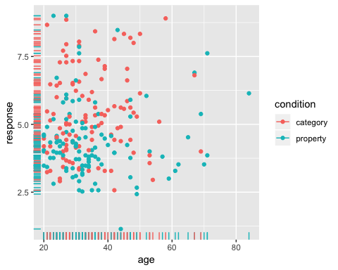

Notice the style here. A pretty typical way to build a visualisation is to construct it in layers, *adding* new geoms, aesthetics and other plot customisations as you go. So you'll often end up with code structured like this:[3]

    DATA %>%
      ggplot(aes( LIST_OF_AESTHETICS )) +
      A_GEOM +
      ANOTHER_GEOM +
      ETC

In any case, looking at these scatter plots there's nothing that immediately suggests and differential patterns of responding as a function of age but there is a hint that responses are lower in the property sampling condition (blue) than in the category sampling condition (red).

Bar graphs
----------

The humble bar graph is a staple in the scientific literature, and can be rendered by **ggplot2** with the assistance of the `geom_bar()` function. Suppose I want to check that the gender distribution for this study was relatively even across conditions.[4] To do that, I'll set up my mapping with `gender` on the x-axis (using `ggplot` to initialise the plot and `aes` to specify the aesthetics), create separate panels for each `condition` (using `facet_wrap` which I'll explain in more detail below), and then use `geom_bar()` to draw the plot:

``` r
frames_small %>%
  ggplot(aes(x = gender)) +  # set up the mapping
  facet_wrap(~condition) +   # split it into plots
  geom_bar()                 # add the bars!
```

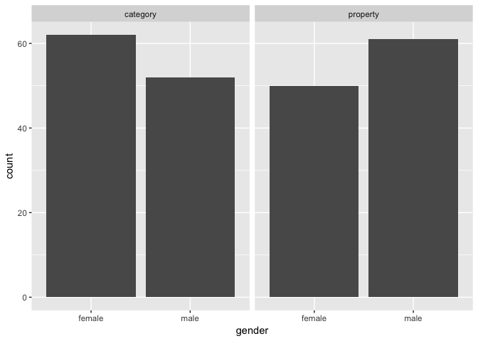

As one would expect for random assignment there's a little unevenness but not very much. That looks totally fine to me, and at this point I've convinced myself that the `age` and `gender` variables really don't matter very much, so I can start digging into the details about how the manipulated variables of theoretical interest (`sample_size`, `condition` and `test_loc`) relate to the inductive generalisation `response` judgment that people make...

Box plots
---------

Another classic data visualisation used in psychology is the box plot (due to John Tukey), which presents a schematic representation of the distribution of responses. Box plots can be drawn in many different forms, but the most conventional version the median value (50th percentile) as a thick horizontal line, contained within a box that spans the range from 25th percentile to the 75th percentile. Above and below the box are the "whiskers" which extend to cover the full range of the data (after excluding outliers). Outliers are plotted as individual dots. Note that in this context an outlier is conventionally defined as a point that lies more than 1.5 times the interquartile range from the median: this is often a convenient heuristic to use but it's not magical. Don't read too much into the fact that a data set includes outliers!

To construct a boxplot using **ggplot2** all we need to do is add a `geom_boxplot()` to the graph. So if I want to plot the distribution of `response` values across participants (averaged across test items) separately for each `condition`, I could do this:

``` r
frames_small %>%
  ggplot(aes(x = condition, y = response)) + 
  geom_boxplot()
```

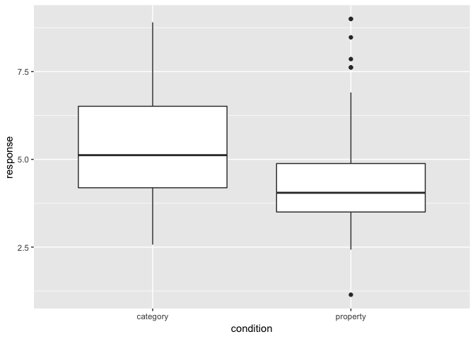

This plot is easy to interpret and provides our first hint that there is in fact something of interest going on in these data. On a first pass, it rather looks like people are less willing to make inductive generalisations (i.e., give lower scores) in the property sampling condition than in the category sampling condition!

Violin plots
------------

Although the box plot is an old method for visualising the key characteristics of distribution it's a very good one. It's visually simple, meaning that you can put a lot of box plots in a single graph without causing too much clutter, yet it still conveys a lot of information about the distribution. So there are many situations in which they are worth including (we'll see a good example in a moment)

On the other hand, for the specific situation here where there are only two disributions to be displayed, it does seem like we could do better. With the state of computing having advanced quite dramatically over recent decades, it is extremely easy to construct more complicated *kernel density estimates* of the shape of the population from which the sample is drawn. The *violin plot* provides a method for visually displaying a kernel density estimate. If we switch from `geom_boxplot()` to `geom_violin()` the resulting plot looks like this:

``` r
frames_small %>%
  ggplot(aes(x = condition, y = response)) + 
  geom_violin()
```

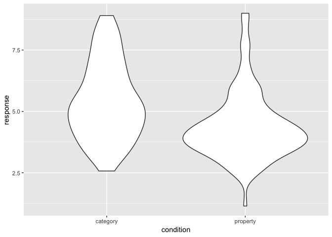

It's intuitively obvious what this plot is doing: the "width" of the violin[5] at each point shows the estimated "density" of the population distribution at that point. To make it a little clearer what this is showing, let's overlay the raw data on the plot, using the `geom_jitter()` method to make it a little easier to see:

``` r
frames_small %>%
  ggplot(aes(x = condition, y = response)) + 
  geom_violin() +
  geom_jitter()
```

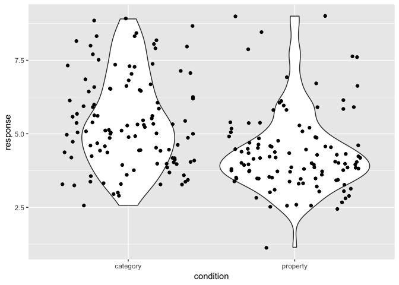

As you can see, in the property sampling condition the data are concentrated pretty tightly around 4.5, whereas in the category sampling condition the data are shifted upwards and spread out. That's what produces the different shapes in the violin plots.

Facetted plots
--------------

The big problem I have with the data visualisations we've drawn so far is that we're really not getting a very fine grained story. When we constructed the `response` variable for the `frames_small` data frame we averaged over all three values of `sample_size` and across all seven values of `test_loc`. That's fine as a first pass if we want to take a quick look at the difference across `condition`, but in real world data analysis we need to hold ourselves to higher standards! So lets go back to the raw `frames` data, and see if we can find a better visualisation. This brings us naturally to the topic of *faceting* a plot...

A common task in data visualisation is to construct facet plots that display an existing plot separately for each group. We've seen this twice already, once in the histogram at the start of this section and previously in the [prelude](./prelude-to-data.html). In both cases I used `facet_wrap()` to do the work, using the `~` operator to specify a one-sided formula (e.g., `~condition`). This function splits the plot by the levels of a factor, and then "wraps" them around to keep the plot tidy. For example, if there were 16 levels of the `condition` variable then `facet_wrap()` would probably give us a 4x4 grid.

If you want more precise control over the faceting, an alternative approach is to use `facet_grid()`. For instance, let's suppose I want to draw separate boxplots for the `response` variable for every possible `test_item`, broken down by `condition` and `sample_size`. That's going to give us 42 boxplots, so some degree of care is required here! Here's my first attempt:

``` r
frames %>%                               # start with the full data set!
  ggplot(aes(
    x = factor(test_item),               # treat "test_item" as categorical
    y = response)) +                     # y variable is "response"
  facet_grid(sample_size ~ condition) +  # add faceting
  geom_boxplot()                         # oh, right... add the boxplots :-)
```

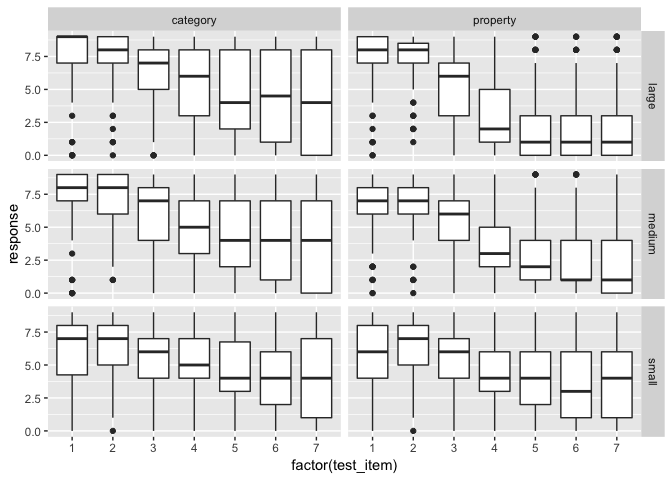

That's not bad as a first pass. There's a few things I'd like to do to tidy it though:

-   Flip the grid by changing the formula to `condition ~ sample_size`
-   Reorder the sample size facets by changing `sample_size` to a factor
-   Adding nicer axis labels using `xlab()` and `ylab()`
-   Make the "outliers" less obtrusive using transparency

To do this, the first thing I'm going to do is use `dplyr::mutate` -- discussed in the previous section -- to convert the `sample_size` variable to a factor, and make sure the levels are specified in the order I want them to appear in the plot:

``` r
frames <- frames %>%
  mutate(sample_size = factor(sample_size, levels = c("small","medium","large")))
```

Now my command to draw the plot looks like this:

``` r
frames %>%                               
  ggplot(aes(
    x = factor(test_item),               
    y = response)) +                     
  facet_grid(condition ~ sample_size) +  # reversed faceting
  geom_boxplot(outlier.alpha = 0.1) +    # alpha sets the transparency
  xlab("Location of Test Stimulus") +    # add x-label
  ylab("Response")                       # add y-label
```


It's essentially the same as before, but we've switched the ordering of variables in `facet_grid()`, added the `outlier.alpha = 0.1` argument to `geom_boxplot()` to make the outliers fade into the background, and then specified some nicer axis titles. The resulting plot is a fair bit more readable.

As for what we're seeing in the data, there are a few different things to notice:

-   Within every facet the responses tend to shift *downwards* from left to right: as the test item becomes less similar to the training items, people are less willing to make generalisations. This pattern of similarity-based generalisation is unsurprising and it's a finding that has been replicated many, many times in the literature.
-   The effect of sample size is inhomogeneous. For stimuli that are very similar to the training items (test locations 1 and 2), increasing the sample size pushes the generalisation *upwards*, regardless of whether category sampling or property sampling is applied
-   For stimuli that are very dissimilar (especially test items 6 and 7), the effect of sample size depends on the sampling method. For category sampling, basically *nothing happens*: the box plots for large sample sizes aren't any different to those for small sample sizes. Yet for property sampling, there's a systematic tendency for these to shift *downwards*

Assuming that these findings replicate[6] it looks like we have a three-way interaction of some kind!

To be honest though, I'm still not pleased with this graph. I think we can do better.

Bubble plots
------------

One difficulty with box plots is that they only work as distributional summaries when the data are unimodal. If most people respond with extreme values, the box plot ends up being a little misleading. Violin plots are often better at capturing multimodality, but they're designed to work for continuous variables and often behave poorly when applied to data that fall in a small number of ordered categories. Psychological data from questionnaires or -- as in the `frames` data set - other ordinal response methods often have exactly this characteristic. Neither box plots nor violin plots are ideally suited to this situation.

Fortunately a bubble plot can help out here. This takes the form of a scatter plot, but instead of plotting every data point as a unique dot, we plot dots at every location whose size (area) is proportional to the number of cases at that location.[7] To do this with **ggplot2** all we need to do is use the `geom_count()` function. When applied to the `frames` data, we get this:

``` r
frames %>%
  ggplot(aes(x = test_item, y = response)) + 
  facet_grid(condition ~ sample_size) +
  geom_count()
```

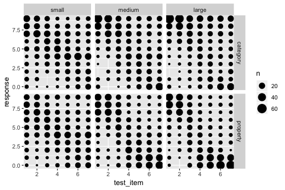

This version of the plot highlights a failure of the box plot version. Compare the distribution of responses to test item 7 in the category sampling condition (top row). In the `small` sample size, the modal response is 4, with most people using the middle category, whereas for the `large` sample size most people are using the extremes, responding with either 0 or 9. However, both cases have the same median and very similar inter-quartile ranges, so the box plots look almost the same!

On the other hand, this plot is a little hard to read. We've added a lot of new detail about the low frequency responses and in doing so learned more about the overall distribution of responding, but that's come at the cost of making it harder to see what the most typical responses are! A compromise that I am often fond of is using shading to slightly de-emphasize the low frequency cases. Larger bubbles should stand out (dark colour), but low frequency responses should fade into the light grey background. It's actually pretty easy to do that: `geom_count()` keeps track of the number of observations in each cell, and so we can add a new aesthetic to the `geom_count()` layer, simply by specifying `colour = ..n..`:

``` r
frames %>%
  ggplot(aes(x = test_item, y = response)) + 
  facet_grid(condition ~ sample_size) +
  geom_count(aes(colour = ..n..))
```

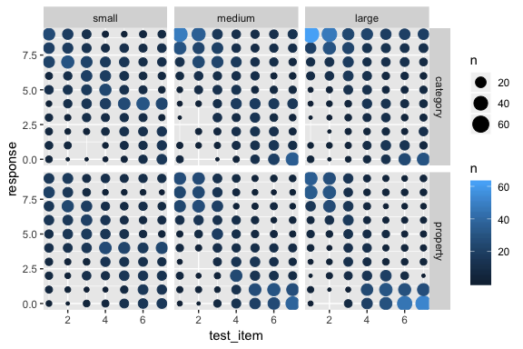

That's a little nicer, but in this case I don't want or need the pretty blue colouring. What I want to do is specify my own grey scale, where larger dots are coloured closer to black (e.g., upper bound is `"grey20"`) and the smaller dots are coloured in a light grey (e.g., lower bound is `"grey80"`).[8] Then all I have to do is this:

``` r
frames %>%
  ggplot(aes(x = test_item, y = response)) + 
  facet_grid(condition ~ sample_size) +
  geom_count(aes(colour = ..n..)) + 
  scale_colour_gradient(low = "grey80", high = "grey20")
```

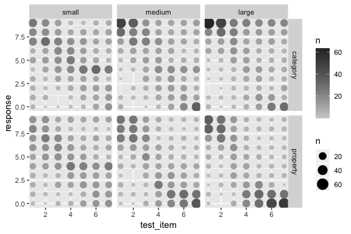

To my mind that's much more readable! It captures the multimodality of the responding without overwhelming the viewer with too much detail. There are still some issues that you might want to care about in real life -- the figure is a little too low contrast for people with less than perfect vision, for instance. But it comes a lot closer to what we need.

Error bars
----------

As much as I love the bubble plot above, academic journals often expect a more compressed representation of the data, especially when the manuscript you're submitting involves a large number of experiments. It's often the case that we want to summarise the data from a single condition using a "mean plus error bar" style plot. A common format is to plot the mean for every experimental condition and have error bars plotting the 95% confidence interval for the mean. To do that for the `frames` data, let's begin by constructing a summary data set

``` r
frames_mean <- frames %>%
  group_by(condition,sample_size,test_item) %>%
  summarise(
    mean_response = mean(response),
    lower = lsr::ciMean(response)[1],
    upper = lsr::ciMean(response)[2]
  )
frames_mean
```

    ## # A tibble: 42 x 6
    ## # Groups:   condition, sample_size [?]
    ##    condition sample_size test_item mean_response lower upper
    ##    <chr>     <fct>           <int>         <dbl> <dbl> <dbl>
    ##  1 category  small               1          6.07  5.55  6.59
    ##  2 category  small               2          6.26  5.84  6.69
    ##  3 category  small               3          5.87  5.50  6.24
    ##  4 category  small               4          5.11  4.74  5.49
    ##  5 category  small               5          4.55  4.12  4.99
    ##  6 category  small               6          4.16  3.69  4.63
    ##  7 category  small               7          3.98  3.44  4.52
    ##  8 category  medium              1          7.32  6.85  7.78
    ##  9 category  medium              2          7.17  6.80  7.54
    ## 10 category  medium              3          5.98  5.54  6.42
    ## # ... with 32 more rows

In this case I'm using the `ciMean()` function from the **lsr** package to compute the 95% confidence intervals. Just so that you can see how this function works -- without all the additional complications from calling it within the `summarise()` operation -- here's a simple example. I'll generate 20 numbers from a normal distribution with true mean 100 and true standard deviation 15 (following the convention used for IQ scores), and then use the `ciMean()` function to calculate a 95% confidence interval:

``` r
fake_iq <- rnorm(n = 20, mean = 100, sd = 15)  # normally distributed data
lsr::ciMean(fake_iq)                           # 95% confidence interval 
```

    ##             2.5%    97.5%
    ## fake_iq 93.86969 108.9438

So the `lower` variable in `frames_mean` is the lower bound on the 95% confidence interval, and `upper` is the upper bound. In any case, now that we have data in an appropriate format we can create the plot.

To add error bars is no more difficult than anything else in **ggplot2**. There is a geom called `geom_errorbar()` that will draw those for us. However, it does need some new information. In our previous graphs we've specifed three aesthetics at the beginning of our graphing exercise, namely `x = test_item`, `y = mean_response` and `colour = condition`. That works fine for `geom_point()` because doesn't need anything else, but `geom_errorbar()` also needs to know which variables specify the `ymin` and `ymax` values that will be displayed in the error bars. If I wanted to, I could could include these aesthetics within the original call to `ggplot()` but I'll do something a little different this time. Individual geoms can have their own unique aesthetics, so I can insert a new call to `aes()` within the `geom_errorbar()` call. Conceptually I find this neater, because it makes clear that `ymin` and `ymax` are aesthetics that apply to the error bars, but not to other geoms in the plot. Anyway here's the command:

``` r
my_pic <- frames_mean %>%
  ggplot(aes(x = test_item, y = mean_response, colour = condition)) +
  geom_point() +
  geom_errorbar(aes(ymin = lower, ymax = upper)) +  # add the error bars!
  facet_wrap(~sample_size)
```

Hey, where's my plot? Oh right... notice that I assigned the result to a variable called `my_pic`. Under the hood, `my_pic` is essentially a big list of information that specifies everything R needs to know to draw the plot. So if we want to *see* the plot, all we need to do is call `print(my_pic)` or `plot(my_pic)`, or even more simply I can do this:

``` r
my_pic
```

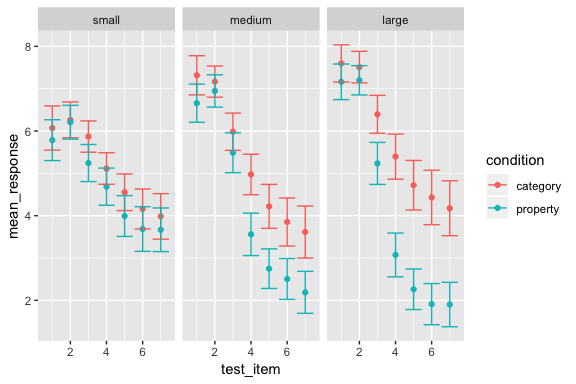

Clearly, when compared to the bubble plot we are losing a lot of information -- all we have left is information about the distributional mean -- but it's still fairly informative about what is going on across the diferent conditions.

Another thing worth noting. Because the test items vary along a continuous scale, it's appropriate to connect the points with lines. I can do this in a straightforward way simply by adding `geom_line()` to the plot:

``` r
my_pic + geom_line()
```

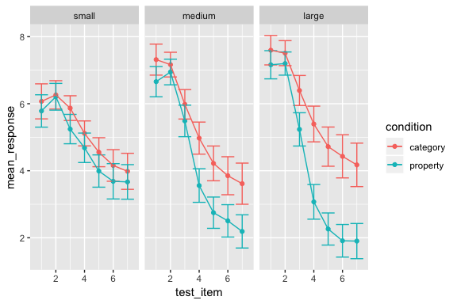

Notice that I can add `geom_line()` directly to `my_pic`. That can be extremely handy if you've worked out what the core features of your plot will be and want to play around with a few possible additions to the plot.

Other possibilities
-------------------

As you can see, there are quite a few things you can do with this package. However, the **ggplot2** package provides many more plotting tools than I've described so far, and it was designed to be extensible so there are many other packages that extend it in interesting ways. Even without looking at other packages, there are various neat possibilities. Just to give you a bit of a sense of this, here are a few more! If I want to add contouring to a scatter plot, I can do this using the `geom_density_2d()` function:

``` r
frames_small %>% 
  ggplot(mapping = aes(x = age, y = response, colour = condition)) +
  geom_point() + 
  theme_bw() +
  geom_density_2d() +
  facet_wrap(~condition) +
  ylim(0,9)
```

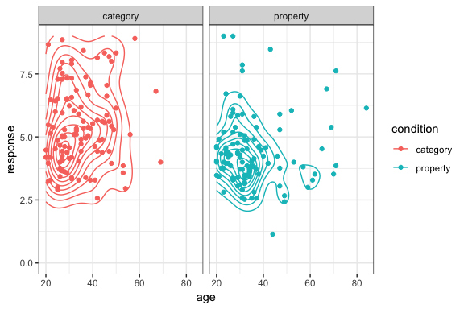

Alternatively, if I want to add regression lines to this plot I can use `geom_smooth()`. By default the `geom_smooth()` function applies a non-linear method (loess regression), which we saw previously in the [prelude](./prelude-to-data.html). This is also customisable. If I want to use a simpler linear model to provide my regression line, all I need to do is specify `method = "lm"` and I get a plot like this:

``` r
frames_small %>% 
  ggplot(mapping = aes(x = age, y = response, colour = condition)) +
  geom_point() + 
  geom_smooth(method = "lm") +
  facet_wrap(~condition) +
  ylim(0,9)
```

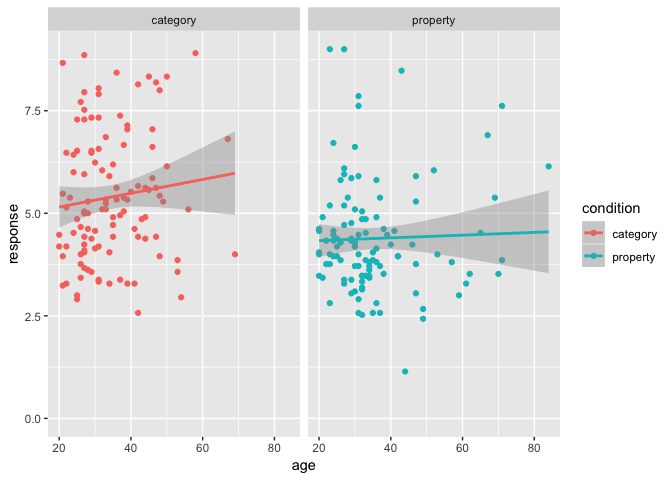

Similarly, plots are customisable in other ways. We can use `theme_dark()` to switch to a dark theme or `theme_bw()` to switch to a black and white scheme. We can add horizontal lines to plots with `geom_hline()`, vertical lines with `geom_vline()` and diagonal lines with `geom_abline()`. The colour palette can be adapted in arbitrary ways (e.g. with `scale_color_brewer`). We can control the axis scales with `xlim()` and `ylim()`. We can add text to a plot with `geom_text()`. Here's an example showing some of those customisation:

``` r
my_new_pic <- my_pic + 
  theme_dark() +
  scale_color_brewer(palette = "Pastel2") +
  ylim(0, 9) + 
  geom_vline(xintercept = 2.5, colour = "white", lty = "dotted") +
  xlab("Location of Test Stimulus") +
  ylab("Mean Response")

my_new_pic
```

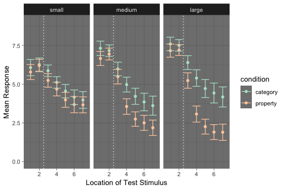

The possibilities are limited mostly by your imagination, and by common sense. The **ggplot2** system is so rich and flexible that it's easy to go overboard with creating pretty pictures. Always remember that there's a human reader at the other end of your picture, and they're more interested in what your data visualisation can tell them about *the data*, not what it says about your R skills! 😀

Saving images
-------------

The last topic I want to cover here is how to save your plot to an image file. Suppose I want to take `my_new_plot` and save it to a PNG file that is 16cm wide and 8cm high. The `ggsave()` function allows me to do that, and the command is pretty intuitive:

``` r
ggsave(
  filename = "./output/frame_pic.png",
  plot = my_new_pic,
  width = 16,
  height = 8,
  units = "cm"
)
```

The function is smart enough to guess from the `filename` argument what kind of image file to create (e.g., PNG, JPG, etc), and so as long as the filename specifies a file extension that `ggsave()` can handle it will automatically create the right kind of image.

More resources
--------------

-   <https://www.r-graph-gallery.com/>

[1] If you are interested, take a look at the various `dev` functions for working with graphics devces, such as `dev.new`, `dev.print`, `dev.off` etc. I won't talk about those here because I'm focusing on **tidyverse** but they're handy in other situations

[2] It's worth acknowledging that **ggplot2** and builds off the **grid** graphics system that we very briefly encountered when using **TurtleGraphics**

[3] There is a little bit of weirdness to this. Once you've gotten accustomed to using the pipe operator `%>%` it starts to feel like we should be writing code like `data %>% ggplot() %>% geom() %>% etc` rather than `data %>% (ggplot() + geom() + etc)`. This is purely for historical reasons: **ggplot2** predates the pipe operator and so unlike everything else in **tidyverse** it's not very compatible with `%>%`.

[4] In this study I asked people to respond with a three value questionnaire, with options for "male", "female" and "other" as possible gender identities. I'm not entirely satisfied with this as a measurement method though, and the question wasn't compulsory to answer.

[5] Yeah, they never actually look like violins. We should just give up and call them blob plots

[6] They appear to -- we ran 9 experiments in total and while some effects are a little fragile and I wouldn't put too much faith in their ability to replicate, the core effect in which there are systematic differences in how statistical information (e.g., sample size, base rate, auxiliary data) interacts with the sampling mechanism replicated every time; oh and if you go read the paper the model predictions correlate with human data very highly, always produce the same qualitative patterns regardless of parametre values... etc, etc. This isn't a cognitive science paper so I won't bore you with details, but the reason this works as cleanly as it does is that we didn't choose these manipulations arbitrarily. We had a proper theory to guide us!

[7] There are drawbacks to bubble plots. The psychophysical function for area isn't linear, so subjective area doesn't scale perfectly with actual area. If you need people to be able to make fine-grained comparisons between quantities don't use bubble plots. However, my goal here is different - I don't mind if we can't quite see the "perfect" relationship, I just want the "gist" to come through properly.

[8] R is quite flexible in how it handles colours. For most purposes you can use an English colour word and R will have a rough idea what you mean. Type `colours()` at the console to see a list of the colour names it knows: there are a lot! Alternatively you can specify a hexadecimal string like `#88398A`, or use a function like `rgb()` or `hsv()` to construct the colour you want.
