<h1 class="title toc-ignore display-3">
Version control with git
</h1>
================
Danielle Navarro
30 November 2018

<!--

  html_document:
    includes:
      in_header: header.html
    theme: flatly
    highlight: textmate
    css: mystyle.css

-->
Installing git
--------------

The first thing we need to do is make sure you have a working version of git on your computer, which we'll be referring to as the *local* machine thoughout this tutorial. Installing git on your local machine is (hopefully) not too difficult. There are several different ways you can do it, but the simplest ones are listed below:

-   For Windows users, go to <https://gitforwindows.org/>. When installing, make sure you select the "Use Git from the Windows Command Prompt" option.
-   For Mac users, you can install the "Xcode command line tools" from the App Store (you don't need all of Xcode), which comes with git

Once you've completed the installation, it's a good idea to check that everything worked. For Windows users, open the Windows Command Prompt and type `git --version`. When I do this on my machine this is what I get:

    > git --version

    git version 2.19.1.windows.1

For Mac users it's exactly the same except you open the Terminal. When I do this on my Mac it turns out I have a slightly dated version of git, and should probably update at some point:

    > git --version 

    git version 2.15.2 (Apple Git 101.1)

As long as you're getting a message that tells you that git exists then you're good to go.

Introducing yourself to git
---------------------------

In a moment we'll get you to sign up for an account with GitHub, but while we're here at the command line, we might as well make a few settings. You can tell git who you are by using the `git config` command. For me, that means I do this:

    git config --global user.name 'Danielle Navarro'
    git config --global user.email 'd.navarro@unsw.edu.au'

Jenny Bryan has some [very good advice](http://happygitwithr.com/hello-git.html#more-about-git-config) about some important config settings you can play with. You can see more about what the various options are with this command:

    git config --global --list

Getting a GitHub account
------------------------

The next step in the process is setting up an account with a service that hosts *remote* git repositories for you in the cloud. There are many different services, but we'll use GitHub for this. Go to the GitHub website at <https://github.com/> and follow the sign up instructions. Some notes:

-   Pick a sensible username, because there's a good chance it will follow you around for a long time. You can change your username, but bad things can happen.
-   When you sign up for an account it *will* need to be associated with an email address. You should pick the address that makes sense for you (probably your university account)
-   A nice feature if you have a university email address and are using GitHub for edication: youcan apply for a "developer" account (which are normally $7/month) for free You can apply for it by following the instructions [here](https://help.github.com/articles/applying-for-an-academic-research-discount/). It can take a few days, though mine was approved in minutes.
-   **Important**: the email address that you use for GitHub needs to be the same one that you listed in the `git config` command earlier.

Client or command line?
-----------------------

There are several differnt ways you can use git, but maybe the biggest distinction is between using the *command line* tools (typing commands in at the Windows Command Prompt or the Mac Terminal) and using a *git client* (software that has a nice graphical user interface). In the long run it's probably worthwhile exploring a few different git clients: as Jenny Bryan says, it will spare you the tediousness of ["command line bullshittery"](http://www.pgbovine.net/command-line-bullshittery.htm). [GitKraken](https://www.gitkraken.com/) is a fairly popular option, but RStudio now has a nice git client built in, so you might want to explore that.

That being said for our purposes we're going to use the command line. That's not because we want to be "hardcore" but because most git clients are built for people who already understand git, and so the user interface is designed to show you "everything at a glance", and (for me at least) the visual complexity of it is overhwleming. Because this is just a "getting started" tutorial we'll just stick to some simple commands.

Our first workflow: Backing up your work to GitHub
--------------------------------------------------

Git and GitHub can be used in lots of ways, but let's start simple! Let's suppose you're about to start a new project that you're going to call `summerschool`. What you'd like to do is keep all your work associated with this project in a folder called `summerschool`, and you want it to be backed up in the cloud (and ideally, to automatically keep track of the history, so you can go back to earlier versions if you want). That's something you could do with a combination of Dropbox and Time Machine, but let's do it with git and GitHub!

### Creating the repository on GitHub

The way that git "thinks" of things is to imagine that the version of your work on the *remote machine* (GitHub) is the *origin* of the project, and the version on your *local machine* is your copy of that project, so let's mirror that logic. Go to to your GitHub homepage (for me that's <https://github.com/djnavarro>), and select *"new repository"* as shown below:

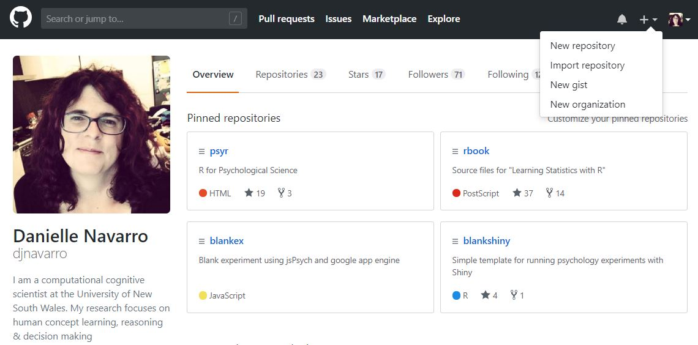

That will take you to a screen that asks you for some information about the repository.

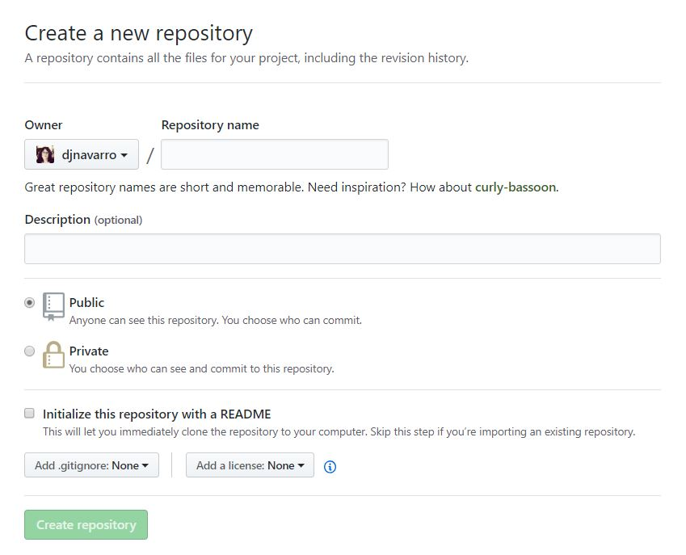

Come up with a name for your repository, like oh I don't know *summerschool*, check the "initialise with a README" option, write a description, and select R from the *.gitignore* menu.

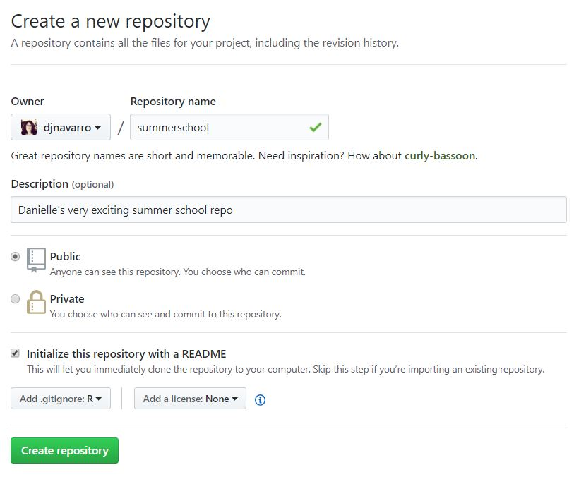

When you click on the *create repository* option, GitHub now creates a homepage for your ne repository (e.g., <https://github.com/djnavarro/summerschool>) and immediately redirects you to it. So you might be looking at something like this:

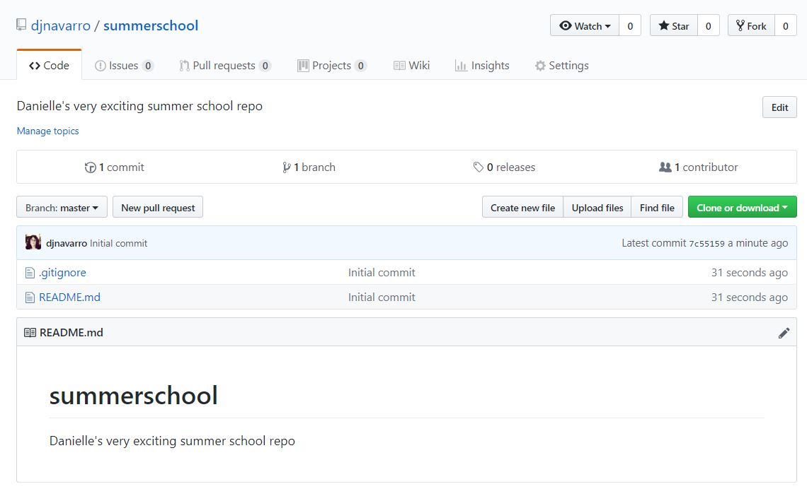

What you'll immediately notice is that there are two files:

-   `README.md` is a plain text file (using markdown formatting) that provides a description of your project, and GitHub automatically displays that file for you
-   `.gitignore` is also a plain text file that lists various types of file that your git repository is going to "ignore". We'll talk a bit about that later.

Your repository now exists on GitHub! Nice work!

### Cloning the repository to your local machine

Next step is to have a copy of it on your local machine! We're going to do that at the command line. So, open the Windows Command Prompt or Mac Terminal. I keep all my git repositories in a single folder, so my first action is to use the `cd` command to "change directory" to the location where you want to copy your project. Windows version:

    > cd C:\Users\Dan\GitHub

Mac version:

    > cd /Users/Dan/GitHub

Now what we want to do is use a `git clone` command, which will make a copy (clone) of the repository on your local machine, like this:

    > git clone https://github.com/djnavarro/summerschool.git

You'll see some output that looks like this:

    Cloning into 'summerschool'...
    remote: Enumerating objects: 4, done.
    remote: Counting objects: 100% (4/4), done.
    remote: Compressing objects: 100% (4/4), done.
    remote: Total 4 (delta 0), reused 0 (delta 0), pack-reused 0
    Unpacking objects: 100% (4/4), done.

If you then open up Explorer (on Windows) or Finder (on Mac) and take a look, you'll see that there is a new folder called `summerschool` on your computer that contains the files. On Windows, you're probably looking at something like this:

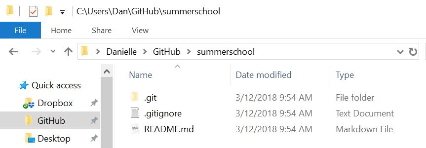

On a Mac it should look similar *BUT* there's a good chance that you can't see the `.git` folder or the `.gitignore` file. They do exist, but by default on a Mac any file that starts with a dot is considered a "hidden file" so Finder won't display it unless you change your settings. But that's okay, we're not going to bother with those for now.

**Important**: Never manually edit the `.git` folder. That's where git does all it's magic and if you tinker with anything it will cry. (Relatedly, as a warning, it's best not to have your git repository inside a Dropbox folder - Dropbox and git don't play well together. Besides, we're using GitHub to backup and sync so we don't actually need Dropbox)

### Learning about our new git repository

Right, so now we have a local copy. Before making any changes, let's explore it a little. First off, let's find out what our `git status` is. So let's go back to the command line and type this:

    >git status

What you see is this:

    On branch master
    Your branch is up to date with 'origin/master'.

    nothing to commit, working tree clean

What this is telling you is:

-   The name for the current "branch" (right now our project only has one branch) is *master*
-   Your copy of this branch is up to date (i.e., it's the same as the *origin* on GitHub)
-   You haven't made any local changes, so you have nothing to *commit*.

One really nice thing about having cloned from GitHub, is that your local repository already "knows" where the remote origin is! You can see that by typing:

    > git remote --verbose

What you see is this:

    origin  https://github.com/djnavarro/summerschool.git (fetch)
    origin  https://github.com/djnavarro/summerschool.git (push)

What this is telling you is that your local git repository is treating the remote GitHub version as the *origin*, both for the purposes of pulling (or fetching) *from* the remote, and for pushing *to* the remote location.

Making local changes...
-----------------------

Okay, next up, let's make some changes. First, open up the `README.md` file on your computer. The `.md` file extension means that this is a "plain markdown" document - it's just a text file, so you can open it in any text editor, but we'll do it in RStudio. To do that, go `File > Open File` in the menus, then select the `README.md` file. Here's what I see:

If you click on the `Preview` button, RStudio will show you the pretty version that GitHub displays. So let's now edit it. Maybe you want to make a nicer description of what your repository is about? This is a very good place to do it! What I did is write out a very quick tutorial on markdown:

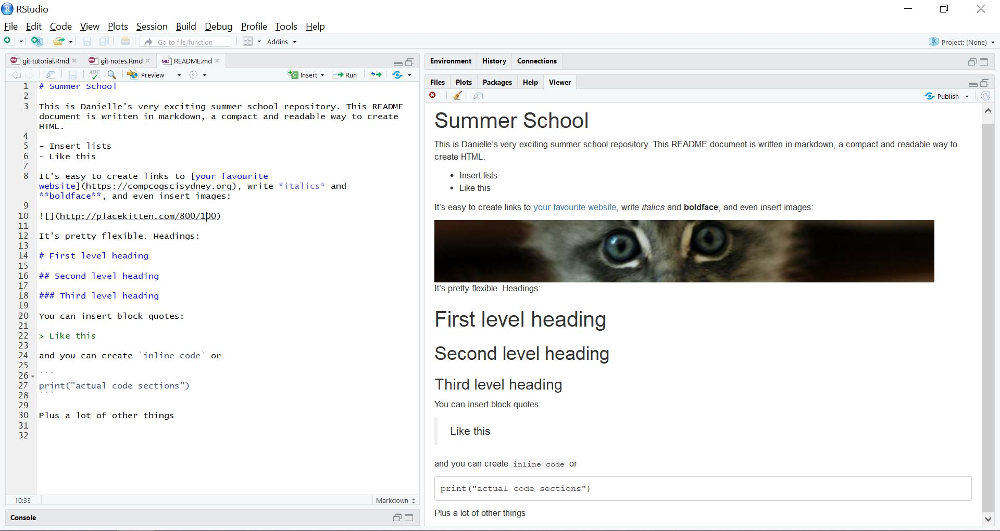

You can see the actual markdown on the left hand side, and the preview of the output on the right hand side.

Make sure you save the document after you've made your changes!

Stage and commit your changes locally...
----------------------------------------

At this point we've made some changes to the documents, but haven't actually done anything with git. Nevertheless, git is "aware" that something has changed. To see this, let's check the `git status`. Back at the command line:

    > git status

The output *starts* the same way as before...

    On branch master
    Your branch is up to date with 'origin/master'.

But now there's something new content:

    Changes not staged for commit:
      (use "git add <file>..." to update what will be committed)
      (use "git checkout -- <file>..." to discard changes in working directory)

            modified:   README.md

    Untracked files:
      (use "git add <file>..." to include in what will be committed)

            README.html

    no changes added to commit (use "git add" and/or "git commit -a")

What this is saying:

-   Git knows you have *modified* one file (`README.md`)
-   Git also knows you have created a new file (`README.html`)

These changes haven't been "committed" to your repository yet. So we should do that! One slightly counterintuitive thing about git is that making a commit is a two stage process. First you have to *stage* your changes (i.e., tell git what you're going to commit), and then *commit* those changes (i.e., actually do it). Apparently there's a good reason for this, but I can't say I've ever found it helpful. But let's do as the silly little thing asks.

First, to stage our commits we use the `git add` command. We could add the files one by one, but I almost never do that. Instead, I do this:

    > git add --all

To see what this has done, let's check our status again:

    > git status

    On branch master
    Your branch is up to date with 'origin/master'.

    Changes to be committed:
      (use "git reset HEAD <file>..." to unstage)

            new file:   README.html
            modified:   README.md

Now you can see that git has staged both of our changes. Sweet. Now it is time to `git commit`. Whenever you commit your changes, you have to write a *commit message*, which is a little note to yourself (or your collaborators) specifying what you've done. There's quite a lot that's been written about how to write good commit messages, and I'll be honest I write terrible ones. Let's not worry about that for now, and do a simple one:

    > git commit -m "updated the readme.md document"

Notice that we've used the `-m` flag to indicate that there will be a message, and then I've written `"updated ..."` as the actual message. When I hit enter, this happens:

    [master 6c0b71c] updated the readme.md document
     2 files changed, 218 insertions(+), 2 deletions(-)
     create mode 100644 README.html
     rewrite README.md (100%)

Okay, stuff has happened. Good. Let's check our status again:

    >git status

    On branch master
    Your branch is ahead of 'origin/master' by 1 commit.
      (use "git push" to publish your local commits)

    nothing to commit, working tree clean

Woohoo, we have successfully made a commit!

### Pushing your commit to GitHub

At the moment, all your changes are local. Notice the little part of the `git status` outout that says this:

    Your branch is ahead of 'origin/master' by 1 commit.

Git knows that your local version is now "ahead" of the remote version. We should probably `git push` that up to GitHub. This is really easy:

    git push -u origin master

What this command is saying is push *to* the "origin" (GitHub), *from* your current local branch (which, as we were saying earlier, is called "master"). The `-u` part is short for "upstream" and it [comes in handy](https://www.quora.com/What-does-the-u-tag-mean-in-git-push-u-origin-master) later. Frankly though, I just mindlessly include the `-u` every time for the sake of my sanity. Anyway, what you will see (probably after being asked for your username and password), is this:

    Enumerating objects: 6, done.
    Counting objects: 100% (6/6), done.
    Delta compression using up to 4 threads
    Compressing objects: 100% (4/4), done.
    Writing objects: 100% (4/4), 241.74 KiB | 6.53 MiB/s, done.
    Total 4 (delta 0), reused 0 (delta 0)
    To https://github.com/djnavarro/summerschool.git
       7c55159..6c0b71c  master -> master
    Branch 'master' set up to track remote branch 'master' from 'origin'.

It's now pushed to GitHub. If I go there and take a look, I can see that the GitHub page now has changes:

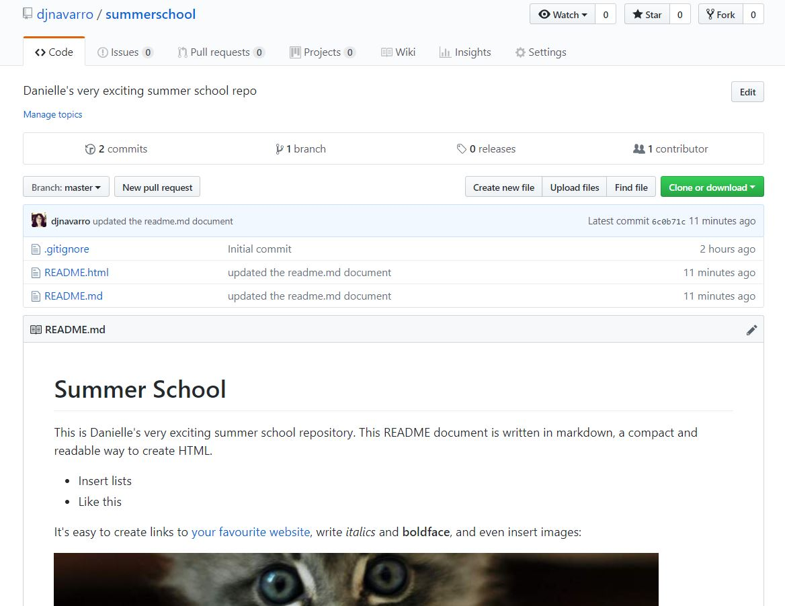

Excellent.

You now have all the skills required to use GitHub as if it were a Dropbox folder. Any time you accidentally set fire to your computer, you can just `git clone` the repository from GitHub to another machine and keep working. Admittedly, you could probably have done all this in Dropbox, but the GitHub version looks cooler, doesn't it? There are other *actual* advantages though. I promise! I wouldn't force you to learn this if there weren't!

Our second workflow
-------------------

One of the appealing things about git and GitHub is that you can collaborate easily with other people, and share your work with them. Like anything in life, this can get messy in some situations, but the basics are actually pretty easy to get a handle on. In this scenario, I'm going to assume you're working together with one other person, but at no point will you both be trying to edit the same document at the same time.

### Adding a contributor on GitHub

Let's suppose I want to work with Matthew Ling and Emi Tanaka on this project. They're both on GitHub, so I can go to the *Settings* tab on GitHub and then select *Collaborators* from the menu on the left. If I start typing in their names, it will search for them:

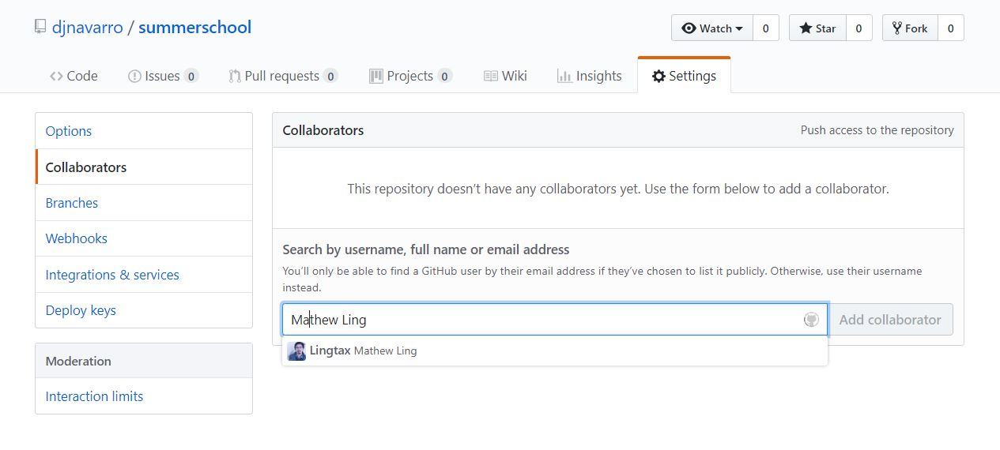

When I click on the *Add collaborator* button, it will send an email inviting them to join the repository. Once they accept, they'll have the ability to push changes to the GitHub version. So while I'm writing this, I'm waiting for one of them to accept, this is what I can see...

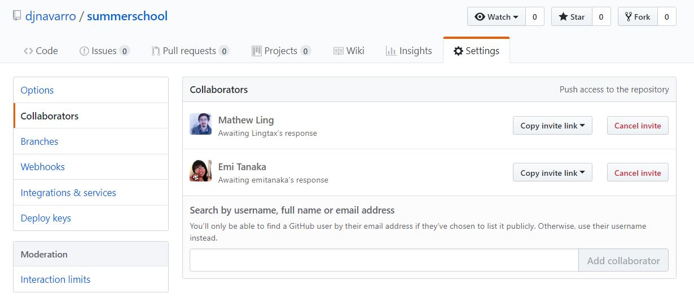

### Working together

Eventually though, one of them will come and help me out. On their side, once they've accepted it's exactly the same process as we followed when cloning it to the local machine! At their command line they'd type this...

    > git clone https://github.com/djnavarro/summerschool.git

Then they make their changes, commit them, and then use

    > git push -u origin master

to push them back to GitHub. Unfortunately, collaborators are just as human as you are, so these changes won't happen instantaneously. Given that Emi and Mathew both have jobs and lives of their own, the fact that I asked them to help me out on Twitter doesn't mean they're going to drop everything to solve my problems (no matter how lovely they both are). Nevertheless, I'm working to a pretty tight deadline here, so I'm going to make some edits to *other* documents -- not the one they're going to play with -- and make local commits. What I'll do is create a new file, called `gitcheatcheet.md` that we can use to make notes, and commit those changes.

While I've been doing this, it turns out that one of my collaborators has updated the README, and pushed some new commits to GitHub...

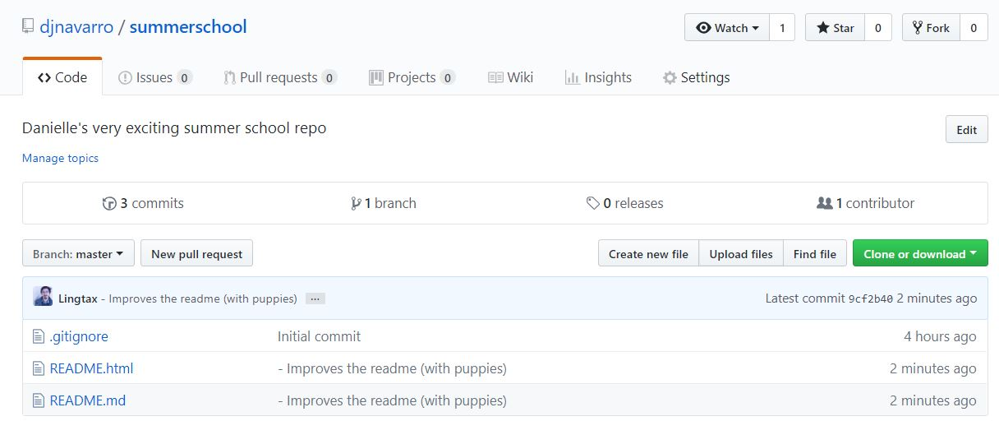

Okay, now let's suppose I hadn't actually noticed this, and tried to push *my* changes to the repository! Let's see what happens:

    >git push -u origin master

    To https://github.com/djnavarro/summerschool.git
     ! [rejected]        master -> master (fetch first)
    error: failed to push some refs to 'https://github.com/djnavarro/summerschool.git'
    hint: Updates were rejected because the remote contains work that you do
    hint: not have locally. This is usually caused by another repository pushing
    hint: to the same ref. You may want to first integrate the remote changes
    hint: (e.g., 'git pull ...') before pushing again.
    hint: See the 'Note about fast-forwards' in 'git push --help' for details.

Nope. Git is angry at me now, but at least it's nice enough to tell me what the problem is. The remote branch (GitHub) has some commits that I haven't incorporated locally. Eek. Now, the nice thing is that Mathew and I were working on different files, and our changes are completely compatible with each other (more precisely there are no *conflicts*). So it's an easy fix. All I have to do is `git pull` from GitHub into my local version:

    > git pull

    remote: Enumerating objects: 7, done.
    remote: Counting objects: 100% (7/7), done.
    remote: Compressing objects: 100% (2/2), done.
    remote: Total 4 (delta 2), reused 4 (delta 2), pack-reused 0
    Unpacking objects: 100% (4/4), done.
    From https://github.com/djnavarro/summerschool
       6c0b71c..9cf2b40  master     -> origin/master
    Merge made by the 'recursive' strategy.
     README.html | 8 ++++++--
     README.md   | 4 +++-
     2 files changed, 9 insertions(+), 3 deletions(-)

Yeah yeah, whatever. The main thing to notice here is that git has automatically *merged* the changes. What that means is that Mathew's new edits have been added to my local repository, *without* overwriting mine!

Now that I've used `git pull` to incorporate his changes into my local copy, I can push mine up:

    > git push -u origin master

    Enumerating objects: 7, done.
    Counting objects: 100% (7/7), done.
    Delta compression using up to 4 threads
    Compressing objects: 100% (4/4), done.
    Writing objects: 100% (5/5), 618 bytes | 618.00 KiB/s, done.
    Total 5 (delta 2), reused 0 (delta 0)
    remote: Resolving deltas: 100% (2/2), completed with 2 local objects.
    To https://github.com/djnavarro/summerschool.git
       9cf2b40..540dd43  master -> master
    Branch 'master' set up to track remote branch 'master' from 'origin'.

If I now click on the bit that says *5 commits*, GitHub will show me the commit history for this project:

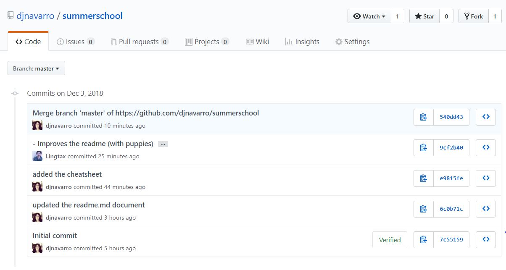

Better yet, if we then click on the `README.md` file on GitHub, and then click on the *Blame* tab. This will bring up a view like this:

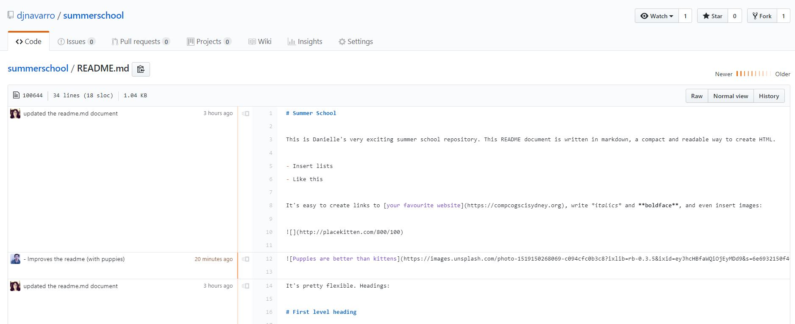

On the right hand side you can see the raw file, and on the left you can see who wrote each part, and displays the commit message that accompanies each edit.

### Using the issue tracker

We saw earlier that the blame tab is useful for keeping track of *who* made each change to the document, as well as *when* and *why* they did it (assuming that they wrote useful commit messages!) This is a nice automatic collaboration feature. However, often when working on a project you'll want to leave notes to yourself, have discussions with collaborators, flag issues that still need to be resolved and so on. This is where the GitHub issue tracker is useful:

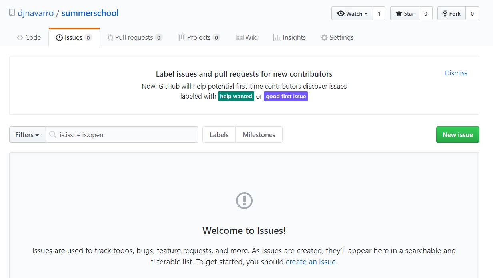

Right now I have no idea what I want to do with this repository, but I do think it might be nice to have a decent cheat sheet, so I've created a new issue:

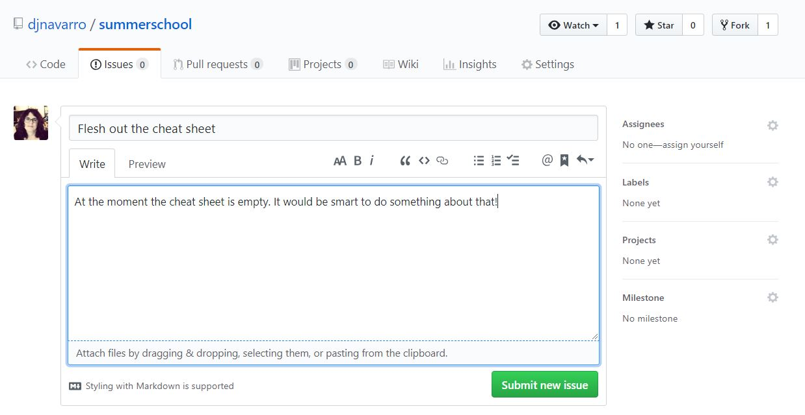

Pull requests!
--------------

The thing about having your code up in public is that other people can suggest changes. On the one hand, that's terrifying because *everyone* feels insecure about their code, but on the other hand it's awesome because people will fix your mistakes and be really helpful! In fact, while I've been playing around with the issue tracker, that's exactly what happened:

Let's click on the *pull requests* link and take a look:

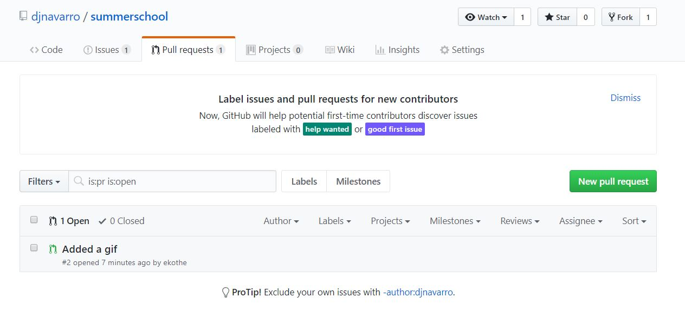

Looks like someone wants to add a GIF to the README. Let's click on this and see if there are some more details:

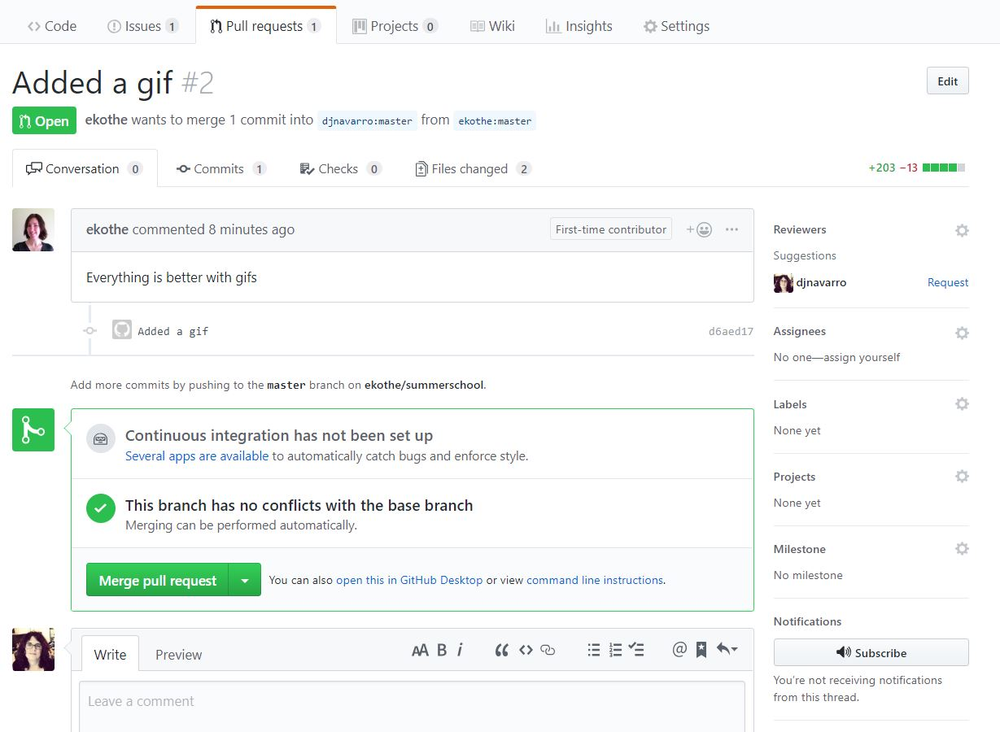

Yes, that is true. Everything is better with GIFs, so I agree with the spirit of this pull request. Still, before merging I should *probably* take a look and make sure everything is okay. I love GIFs and I do trust Emily, but still... let's click on the *files changed* tab:

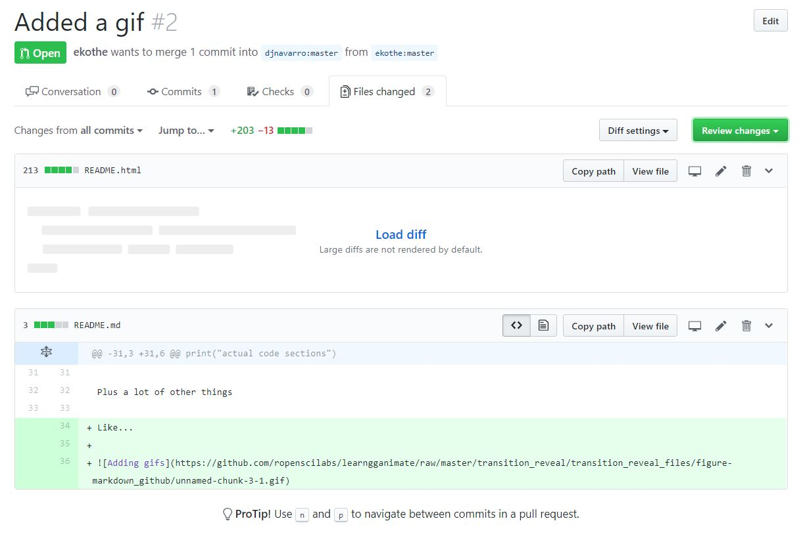

Okay, that makes sense: the bits in green here show the lines she wants to add to the README. (If there were deletions they'd be shown in red). So I'll click on the *Review changes*, write a polite review and then approve the changes:

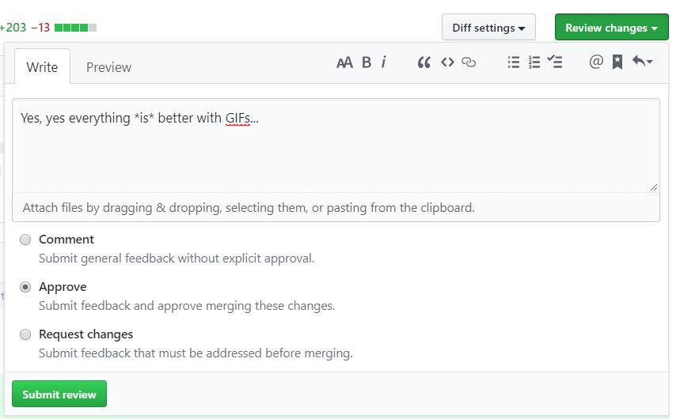

At this point I've reviewed and approved of the changes. So all I need to do is merge them...

Ther are a few differnet options. I generally go with "merge commit", which directly adds all of Emily's commits to the project..

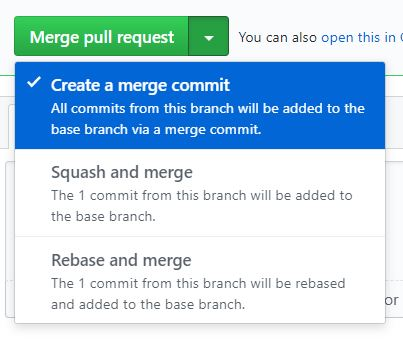

GitHub asks me to confirm...

And now if we go back can see that there are two new commits to the repository, Emily's changes that added the GIF, and my merge that pulled her changes into the branch:

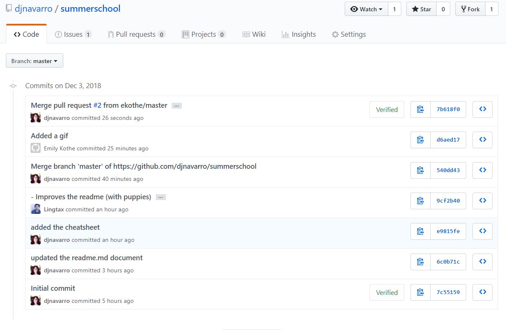

And now if we look at the README it has an animated GIF in it!

Beyond the basics?
------------------

Once you're comfortable, there's more cool things you can do. Suppose you want to try out a really cool idea, but maybe it won't work; you can create a new *branch* of the repository, which lets you make whatever changes you want. If it doesn't work, you can switch back to the master branck. If it does, you can merge the new changes back in. You can zoom forward and backward in time, inspecting the repository at different stages of development. You can create your own *fork* of someone else's repository, and if you want them to make some changes you can make a *pull request* which asks them to incorporate your code into their work. These workflows are all very cool, and a lot of them can all be done without having to leave RStudio, but we won't cover those here. Instead I'll suggest that when you're ready, have a read through some of these resources...

-   [Git cheat sheet](https://services.github.com/on-demand/downloads/github-git-cheat-sheet.pdf) on the GitHub web page.
-   [Happy Git and GitHub for the useR](http://happygitwithr.com/) by Jenny Bryan and Jim Hester
-   [How to make your first pull request](https://github.com/thisisnic/first-contributions) by Nic Crane
-   [Git for Scientists](https://github.com/MilesMcBain/git_4_sci) by Miles McBain.
-   [More stuff](https://lab.github.com/courses) on the GitHub web page
