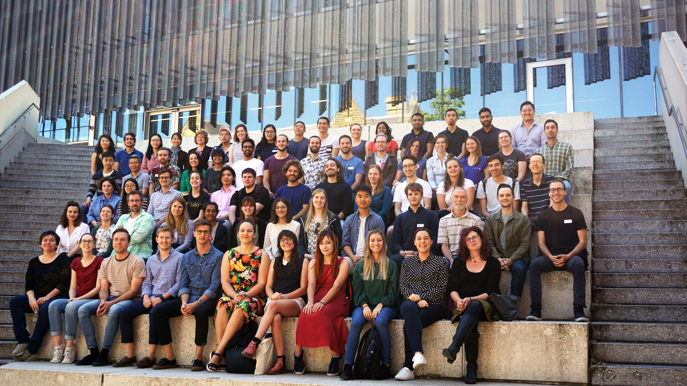

```{r,echo=FALSE}
rm(list=objects()) # start with a clean workspace
```

Researchers from psychology and other disciplines are increasingly relying on computational analyses of large data sets to draw conclusions about human behaviour. This kind of research
requires skills that are not often taught as part of the psychology curriculum, and the Melbourne School of Psychological Sciences is therefore pleased to announce the first annual Complex Human Data summer school.



