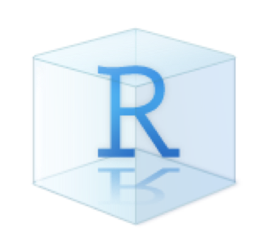
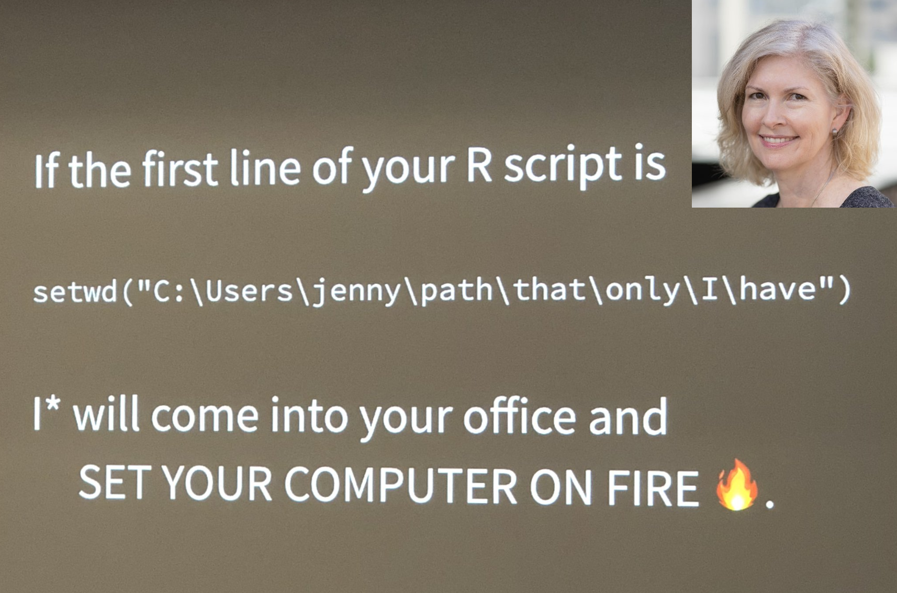
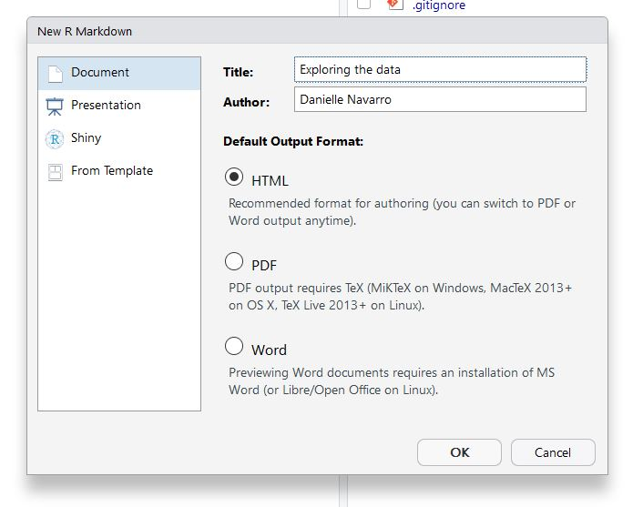
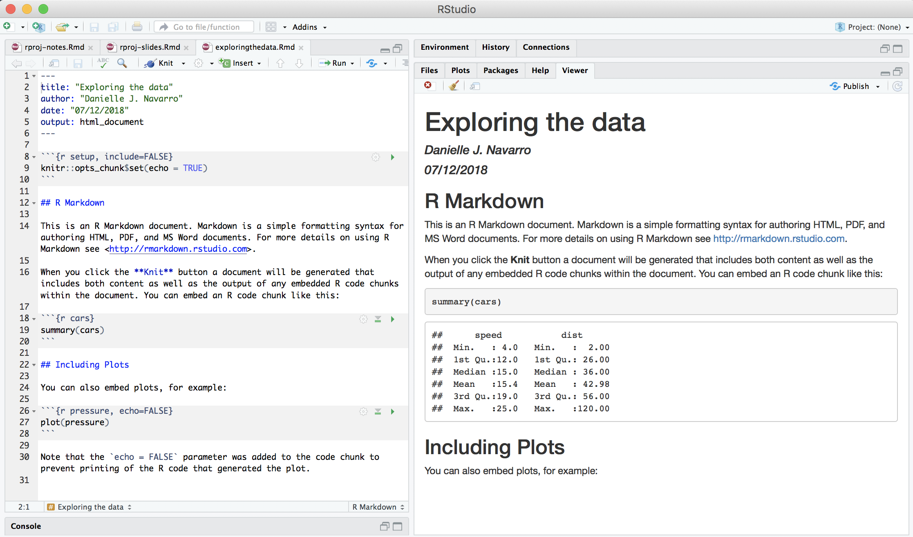

```{r setup, include=FALSE}
options(htmltools.dir.version = FALSE)
```


class: bg-main1 center middle hide-slide-number

.reveal-text.bg-main2[.pad1[
.font4[RStudio projects]
]]


---

class: split-two bg-main1

.column.bg-main1[.content.vmiddle.center[

# Introduction

<br>

.pull.left[.pad1[

### .orange[**What?**] Tool for R to track your project
### .orange[**Why?**] Because file paths are a nightmare
### .orange[**How?**] I'm so glad you asked...

]]

]]

--
.column.bg-main3[.content.vmiddle.center[



]]


<!-- *********** NEW SLIDE ************** -->
---
class: split-two bg-main1

.column.bg-main1[.content.vmiddle.center[

# How to create

.pull.left[.pad1[.font2[

- RStudio projects menu (top right)
- New Project > Existing Directory
- Create in the same folder as the git repo
- Drop down list of projects in the menu

As usual, the details are in [the tutorial](https://djnavarro.github.io/chdss2018/projects.html)
]]]
]]

.column.bg-main3[.content.vmiddle.center[


]]


<!-- *********** NEW SLIDE ************** -->
---

class: bg-main1 center middle

# Behold our creation!
<br>

<br>


<!-- *********** NEW SLIDE ************** -->
---

class: split-two bg-main1

.column.bg-main1[.content.vmiddle.center[

# One benefit to projects...


.pull.left[.pad1[
.font2[
- Close RStudio. Reopen by clicking .Rproj file
- R is automatically in the "correct" folder
- Switch between projects using the menu
]

]]
]]

--
.column.bg-main3[.content.vmiddle.center[


]]


<!-- *********** NEW SLIDE ************** -->
---

class: bg-main1 center middle hide-slide-number

.reveal-text.bg-main2[.pad1[
.font4[Taking the pain out of file paths]
]]


<!-- *********** NEW SLIDE ************** -->
---

class: bg-main1 center middle

# Only you can prevent laptop fires
<br>


[@JennyBryan](https://twitter.com/JennyBryan)
<br>


<!-- *********** NEW SLIDE ************** -->
---

class: bg-main1

.pad2[
.pull.left[.font2[
- The "here" package is better than a laptop fire
- Detects the .Rproj file (or a .here file if you have one)
- Tells you where the project root is:
]
```{r}
library(here)
```
]]
--
.pad2[.pull.left[.font2[
- Use the here function to specify paths:
]
```{r}
location <- here("analysis","data","mydatafile.csv")
print(location)
```
]]


<!-- *********** NEW SLIDE ************** -->
---

class: split-two bg-main1

.column.bg-main1[.content.vmiddle.center[

# git + projects + here 

.pull.left[.pad1[
.font2[
Your code... 
- is portable across operating systems
- is easy for other people to download
- stills works if you move the folder
- doesn't produce "mysterious" fires
]

]]
]]

--
.column.bg-main3[.content.vmiddle.center[


]]


<!-- *********** NEW SLIDE ************** -->
---

class: bg-main1 center middle hide-slide-number

.reveal-text.bg-main2[.pad1[
.font4[R Markdown]
]]


<!-- *********** NEW SLIDE ************** -->
---

class: split-two bg-main1

.column.bg-main1[.content.vmiddle.center[

.pull.left[.pad1[

.font2[
- File > New File > R Markdown
- Enter information in dialog box (right)
- Save the file
- Click "Knit"
]
]]
]]

.column.bg-main3[.content.vmiddle.center[


]]


<!-- *********** NEW SLIDE ************** -->
---

class: bg-main1 center middle

# The result is a nice HTML file and a short R Markdown tutorial.<br>Before the next part, try writing something with R Markdown
<br>

<br>


<!-- DONE -->
---

class: bg-main1 middle center

## thank u, next


