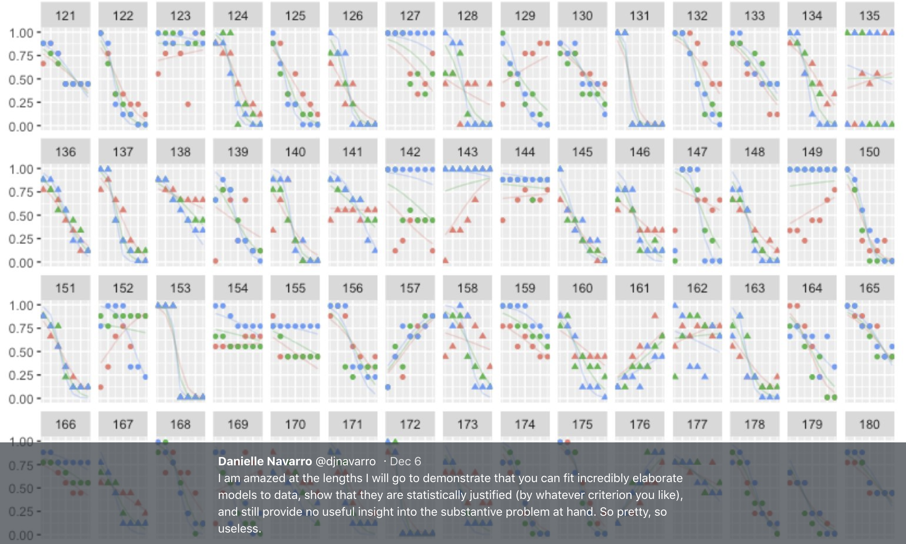

```{r setup, include=FALSE, message=FALSE}
options(htmltools.dir.version = FALSE)
library(here)
library(tidyverse)
library(lme4)
frames <- read_csv(here("analysis","data","frames_ex2.csv"))

library(knitr)
hook_output <- knit_hooks$get("output")
knit_hooks$set(output = function(x, options) {
  lines <- options$output.lines
  if (is.null(lines)) {
    return(hook_output(x, options))  # pass to default hook
  }
  x <- unlist(strsplit(x, "\n"))
  more <- "..."
  if (length(lines)==1) {        # first n lines
    if (length(x) > lines) {
      # truncate the output, but add ....
      x <- c(head(x, lines), more)
    }
  } else {
    x <- c(more, x[lines], more)
  }
  # paste these lines together
  x <- paste(c(x, ""), collapse = "\n")
  hook_output(x, options)
})
```


class: split-40 bg-main1

.column.bg-main1[.content.vtop.center[

.pull.left[.pad1[.font2[
```{r, eval=FALSE, message = FALSE}
tinyframes <- frames %>%
  group_by(id, age, condition) %>%
  summarise(
    response = mean(response)
    ) %>%
  ungroup()
```

]]]
]]

.column.bg-main3[.content.vtop.center[
.pull.left[.pad1[.font2[


# Simplified data set 

- Average all responses by an individual
- Ignores effect of number of observations
- Each person provides one "average response"
- Impoverished, but easy to analyse!


]]]
]]


<!-- *********** NEW SLIDE ************** -->
---
class: split-40 bg-main1

.column.bg-main1[.content.vtop.center[

.pull.left[.pad1[.font2[
```{r, eval=FALSE, message = FALSE}
tinyframes <- frames %>%
  group_by(id, age, condition) %>%
  summarise(
    response = mean(response)
    ) %>%
  ungroup()

tinyframes #<<
```
]]]
]]

.column.bg-main3[.content.vtop.center[
.pull.left[.pad1[.font2[
```{r maketinyframes, cache=TRUE, eval=TRUE, message = FALSE, echo=FALSE}
tinyframes <- frames %>%
  group_by(id, age, condition) %>%
  summarise(
    response = mean(response)
    ) %>%
  ungroup()

tinyframes
```
]]]
]]


<!-- *********** NEW SLIDE ************** -->
---
class: split-40 bg-main1

.column.bg-main1[.content.vtop.center[

.pull.left[.pad1[.font2[
```{r eval=FALSE, message = FALSE}
tinyframes <- frames %>%
  group_by(id, age, condition) %>%
  summarise(
    response = mean(response)
    ) %>%
  ungroup()

tinyframes %>%
  group_by(condition) %>%
  summarise(
    mean_resp = mean(response), #<<
    sd_resp = sd(response), #<<
    n = n() #<<
  )
```
]]]
]]
--
.column.bg-main3[.content.vtop.center[
.pull.left[.pad1[.font2[
```{r summarisetinyfrmaes, cache=TRUE, eval=TRUE, message = FALSE, echo=FALSE}
tinyframes %>%
  group_by(condition) %>%
  summarise(
    mean_resp = mean(response), 
    sd_resp = sd(response),
    n = n()
  )
```
]]]
]]


<!-- *********** NEW SLIDE ************** -->
---
class: split-40 bg-main1

.column.bg-main1[.content.vtop.center[

.pull.left[.pad1[.font2[
```{r, eval=FALSE, message = FALSE}
tinyframes %>% 
  ggplot(aes(
    x = age, 
    y = response, 
    colour = condition)) + 
  geom_smooth(method = "lm") + #<<
  geom_point()
```

- Is this difference meaningful?
- What tools do we use to assess it?


]]]
]]

.column.bg-main3[.content.vtop.center[
.pull.left[.pad1[.font2[
```{r plottinyfrmaes, cache=TRUE, eval=TRUE, message = FALSE, echo=FALSE}
tinyframes %>% 
  ggplot(aes(
    x = age,  #<<
    y = response, #<< 
    colour = condition)) + #<< 
  geom_smooth(method = "lm") + 
  geom_point()
```


]]]
]]


<!-- *********** NEW SLIDE ************** -->
---
class: split-40 bg-main1

.column.bg-main1[.content.vtop.center[

.pull.left[.pad1[.font2[
```{r, eval=FALSE, message = FALSE}
t.test(
  formula = response ~ condition, 
  data = tinyframes, 
  var.equal = TRUE
)
```

- The answer we were taught.
    - H0: same mean
    - H1: different mean
    - etc, etc

]]]
]]
--
.column.bg-main3[.content.vtop.center[
.pull.left[.pad1[.font2[
```{r ttest, cache=TRUE, eval=TRUE, message = FALSE, echo=FALSE, highlight.output=5}
t.test(
  formula = response ~ condition, 
  data = tinyframes, 
  var.equal = TRUE
)
```

- Yay the magic p<.05. Winning!

]]]
]]


<!-- *********** NEW SLIDE ************** -->
---
class: split-40 bg-main1

.column.bg-main1[.content.vtop.center[

.pull.left[.pad1[.font2[
```{r, eval=FALSE, message = FALSE}
t.test(
  formula = response ~ condition, 
  data = tinyframes, 
  var.equal = TRUE
)
```

- The answer we were taught.
    - H0: same mean
    - H1: different mean
    - etc, etc

]]]
]]
.column.bg-main3[.content.vtop.center[
.pull.left[.pad1[.font2[
```{r ttest2, cache=TRUE, eval=TRUE, message = FALSE, echo=FALSE, highlight.output=8}
t.test(
  formula = response ~ condition, 
  data = tinyframes, 
  var.equal = TRUE
)
```

- Effect size? 
    - I'm not a fan of "standardised" effect size
    - 95% CI for the difference in raw scores...
    - ...it's about 1 point on the 9 point scale
    - divide by std. dev if you want Cohen's d
    
]]]
]]


<!-- *********** NEW SLIDE ************** -->
---
class: bg-main1 center middle hide-slide-number

.reveal-text.bg-main2[.pad1[
.font4[Linear models]
]]


<!-- *********** NEW SLIDE ************** -->
---
class: split-40 bg-main1

.row.bg-main1[.content.vtop.center[

.pull.left[.pad1[.font2[

Linear models:

$\mu_i = b_0 + b_1 X_1 + b_2 X_2 + ... + b_k X_k$ <br>
$Y_i \sim \mbox{Normal}(\mu_i, \sigma)$


]]]
]]

.row.bg-main3[.content.vtop.center[
```{r, cache=TRUE, eval=TRUE, message = FALSE, echo=FALSE, fig.width=5, fig.height=4}
tinyframes %>% 
  ggplot(aes(
    x = age,  #<<
    y = response, #<< 
    colour = condition)) + #<< 
  geom_smooth(method = "lm") + 
  geom_point()
```
]]


<!-- *********** NEW SLIDE ************** -->
---
class: split-40 bg-main1

.row.bg-main1[.content.vtop.center[
.pull.left[.pad1[.font2[

Linear models in R:

```{r, eval=FALSE, message = FALSE}
mod1 <- lm(formula = response ~ 1, data = tinyframes) 
mod2 <- lm(formula = response ~ condition, data = tinyframes)
```
]]]
]]

.row.bg-main3[.content.vtop.center[
```{r, cache=TRUE, eval=TRUE, message = FALSE, echo=FALSE, fig.width=5, fig.height=4}
tinyframes %>% 
  ggplot(aes(
    x = age,  #<<
    y = response, #<< 
    colour = condition)) + #<< 
  geom_smooth(method = "lm") + 
  geom_point()
```
]]


<!-- *********** NEW SLIDE ************** -->
---
class: split-40 bg-main1

.row.bg-main1[.content.vtop.center[

.pull.left[.pad1[.font2[
Inspecting linear models in R:

```{r, eval=FALSE, message = FALSE}
mod1 <- lm(formula = response ~ 1, data = tinyframes) 
mod2 <- lm(formula = response ~ condition, data = tinyframes)
mod2 
```
]]]
]]
--
.row.bg-main3[.content.vtop.center[
.pull.left[.pad1[.font2[
```{r lmdemo, cache=TRUE, eval=TRUE, message = FALSE, echo=FALSE, highlight.output = 7}
mod1 <- lm(formula = response ~ 1, data = tinyframes) 
mod2 <- lm(formula = response ~ condition, data = tinyframes)
mod2 #<<
```

- Hey those numbers look familiar
- Relationship to t.test?

]]]
]]


<!-- *********** NEW SLIDE ************** -->
---
class: split-40 bg-main1

.row.bg-main1[.content.vtop.center[

.pull.left[.pad1[.font2[

Comparing linear models with F-tests:
```{r, eval=FALSE, message = FALSE}
mod1 <- lm(formula = response ~ 1, data = tinyframes) 
mod2 <- lm(formula = response ~ condition, data = tinyframes)
anova(mod1, mod2) #<<
```
]]]
]]
--
.row.bg-main3[.content.vtop.center[
.pull.left[.pad1[.font2[

```{r lmanova, cache=TRUE, eval=TRUE, message = FALSE, echo=FALSE, highlight.output = 7}
mod1 <- lm(formula = response ~ 1, data = tinyframes) 
mod2 <- lm(formula = response ~ condition, data = tinyframes)
anova(mod1, mod2) 
```
]]]
]]


<!-- *********** NEW SLIDE ************** -->
---
class: split-40 bg-main1

.row.bg-main1[.content.vtop.center[
.pull.left[.pad1[.font2[
Comparing several linear models with F-tests:
```{r, eval=FALSE, message = FALSE}
mod1 <- lm(formula = response ~ 1, data = tinyframes) 
mod2 <- lm(formula = response ~ condition, data = tinyframes)
mod3 <- lm(formula = response ~ condition + age, data = tinyframes) #<<
anova(mod1, mod2, mod3) #<<
```
]]]
]]

.row.bg-main3[.content.vtop.center[
.pull.left[.pad1[.font2[
```{r anovalm2, cache=TRUE, eval=TRUE, message = FALSE, echo=FALSE, highlight.output = 8:9}
mod1 <- lm(formula = response ~ 1, data = tinyframes) 
mod2 <- lm(formula = response ~ condition, data = tinyframes)
mod3 <- lm(formula = response ~ condition + age, data = tinyframes)

anova(mod1, mod2, mod3)
```
]]]
]]

---
class: bg-main1 center middle hide-slide-number

# Why do I care about F-tests again????
<br><br>


---
class: bg-main1 center middle 

.pull.left[.pad1[.font2[
# Eh. Let's skip the rant and jump to... TL;DR:

What problem are you trying to solve?
- Hypothesis testing vs estimation?
- Bayesian inference vs frequentist?
- Exploration vs confirmation?
- Decision making vs learning?

Different problems lead to different statistics<br>
Orthodox null hypothesis tests are *specific* tools
]]]

---
class: bg-main1 center middle 

.pull.left[.pad1[.font2[
# Eh. Let's skip the rant and jump to... TL;DR:

What problem are you trying to solve?
- .orange[Hypothesis testing] vs estimation?
- Bayesian inference vs .orange[frequentist]?
- Exploration vs .orange[confirmation]?
- .orange[Decision making] vs learning?

Different problems lead to different statistics<br>
.orange[Orthodox null hypothesis tests] are *specific* tools
]]]


---
class: bg-main1 center middle 

.pull.left[.pad1[.font2[
# Eh. Let's skip the Bayesian rant and jump to... TL;DR:

What problem are you trying to solve?
- .blue[Hypothesis testing] vs estimation?
- .blue[Bayesian inference] vs frequentist?
- Exploration vs .blue[confirmation]?
- Decision making vs learning.blue[???]

Different problems lead to different statistics<br>
.blue[Bayes factors] are *specific* tools
]]]


---
class: bg-main1 center middle 

.pull.left[.pad1[.font2[
# Eh. Let's skip the Bayesian rant and jump to... TL;DR:

What problem are you trying to solve?
- Hypothesis testing vs .yellow[estimation]?
- .yellow[Bayesian inference] vs frequentist?
- .yellow[Exploration] vs confirmation?
- Decision making vs .yellow[learning]

Most of .yellow[my modelling problems] are this!<br>
:-)
]]]


<!-- *********** NEW SLIDE ************** -->
---
class: split-40 bg-main1

.row.bg-main1[.content.vtop.center[
.pull.left[.pad1[.font2[
Akaike Information Criterion?
```{r, eval=FALSE, message = FALSE}
mod1 <- lm(formula = response ~ 1, data = tinyframes) 
mod2 <- lm(formula = response ~ condition, data = tinyframes)
mod3 <- lm(formula = response ~ condition + age, data = tinyframes)
AIC(mod1, mod2, mod3) #<<
```
]]]
]]
--
.row.bg-main1[.content.vtop.center[
.pull.left[.pad1[.font2[
```{r aiclm, cache=TRUE, eval=TRUE, message = FALSE, echo=FALSE, highlight.output=3}
mod1 <- lm(formula = response ~ 1, data = tinyframes) 
mod2 <- lm(formula = response ~ condition, data = tinyframes)
mod3 <- lm(formula = response ~ condition + age, data = tinyframes)

AIC(mod1, mod2, mod3)
```
]]]
]]


<!-- *********** NEW SLIDE ************** -->
---
class: split-40 bg-main3

.row.bg-main3[.content.vtop.center[
.pull.left[.pad1[.font2[
Bayesian information criterion?
```{r eval=FALSE, message = FALSE}
mod1 <- lm(formula = response ~ 1, data = tinyframes) 
mod2 <- lm(formula = response ~ condition, data = tinyframes)
mod3 <- lm(formula = response ~ condition + age, data = tinyframes)
BIC(mod1, mod2, mod3)#<<
```
]]]
]]
--
.row.bg-main3[.content.vtop.center[
.pull.left[.pad1[.font2[
```{r biclm, cache=TRUE, eval=TRUE, message = FALSE, echo=FALSE, highlight.output=3}
mod1 <- lm(formula = response ~ 1, data = tinyframes) 
mod2 <- lm(formula = response ~ condition, data = tinyframes)
mod3 <- lm(formula = response ~ condition + age, data = tinyframes)
BIC(mod1, mod2, mod3)
```
]]]
]]


<!-- *********** NEW SLIDE ************** -->
---
class: bg-main1 center middle hide-slide-number

.reveal-text.bg-main2[.pad1[
.font4[Linear mixed models 1]
]]


<!-- *********** NEW SLIDE ************** -->
---
class: split-40 bg-main1

.column.bg-main1[.content.vtop.center[

.pull.left[.pad1[.font2[
```{r, eval=FALSE, message = FALSE}
modestframes <- frames %>% 
  group_by(id, age, condition, n_obs) %>%
  summarise(response = mean(response)) %>%
  ungroup()

modestframes
```
]]]
]]

.column.bg-main3[.content.vtop.center[
.pull.left[.pad1[.font2[
```{r modestframes, cache=TRUE, eval=TRUE, message = FALSE, echo=FALSE}
modestframes <- frames %>% 
  group_by(id, age, condition, n_obs) %>%
  summarise(response = mean(response)) %>%
  ungroup()

modestframes
```
]]]
]]


<!-- *********** NEW SLIDE ************** -->
---
class: split-40 bg-main1

.column.bg-main1[.content.vtop.center[

.pull.left[.pad1[.font2[
```{r, eval=FALSE, message = FALSE}
whichids <- sample(unique(modestframes$id), 80)
modestframes %>%
  filter(id %in% whichids) %>%
  ggplot(aes(x = n_obs, y = response, colour = factor(id))) +
  geom_point(show.legend = FALSE) + 
  geom_line(show.legend = FALSE, alpha = .3) + 
  facet_wrap(~ condition)
```
]]]
]]

.column.bg-main3[.content.vtop.center[
.pull.left[.pad1[.font2[
```{r plotmodest, cache=TRUE, eval=TRUE, message = FALSE, echo=FALSE}
whichids <- sample(unique(modestframes$id), 80)
modestframes %>%
  filter(id %in% whichids) %>%
  ggplot(aes(x = n_obs, y = response, colour = factor(id))) +
  geom_point(show.legend = FALSE) + 
  geom_line(show.legend = FALSE, alpha = .3) + 
  facet_wrap(~ condition)
```
]]]
]]


<!-- *********** NEW SLIDE ************** -->
---
class: split-40 bg-main1

.row.bg-main1[.content.vtop.center[

.pull.left[.pad1[.font2[
```{r, eval=FALSE, message = FALSE}
modest1 <- lmer(formula = response ~ 1 + (1|id), data = modestframes)
modest2 <- lmer(formula = response ~ condition + n_obs + (1|id), data = modestframes)

anova(modest1, modest2)
```
]]]
]]

.row.bg-main3[.content.vtop.center[
.pull.left[.pad1[.font2[
```{r anovamodest, cache=TRUE, eval=TRUE, message = FALSE, echo=FALSE, cache=TRUE}
modest1 <- lmer(formula = response ~ 1 + (1|id), data = modestframes)
modest2 <- lmer(formula = response ~ condition + n_obs + (1|id), data = modestframes)

anova(modest1, modest2)
```
]]]
]]


<!-- *********** NEW SLIDE ************** -->
---
class: split-40 bg-main1

.row.bg-main1[.content.vtop.center[

.pull.left[.pad1[.font2[
```{r, eval=FALSE, message = FALSE}
modest1 <- lmer(formula = response ~ 1 + (1|id), data = modestframes)
modest2 <- lmer(formula = response ~ condition + n_obs + (1|id), data = modestframes)
modest3 <- lmer(formula = response ~ condition + n_obs + (1 + n_obs|id), data = modestframes)

anova(modest1, modest2, modest3)
```
]]]
]]

.row.bg-main3[.content.vtop.center[
.pull.left[.pad1[.font2[
```{r, eval=TRUE, message = FALSE, echo=FALSE, cache=TRUE}
modest3 <- lmer(formula = response ~ condition + n_obs + (1 + n_obs|id), data = modestframes)
anova(modest1, modest2, modest3)
```
]]]
]]


<!-- *********** NEW SLIDE ************** -->
---
class: split-30 bg-main1

.column.bg-main1[.content.vtop.center[

.pull.left[.pad1[.font2[
```{r, eval=FALSE, message = FALSE}
summary(modest3)
```
]]]
]]

.column.bg-main3[.content.vtop.center[
.pull.left[.pad1[.font2[
```{r summarymodest, cache=TRUE, eval=TRUE, message = FALSE, echo=FALSE, output.lines=1:10}
summary(modest3)
```
]]]
]]


<!-- *********** NEW SLIDE ************** -->
---
class: split-30 bg-main1

.column.bg-main1[.content.vtop.center[

.pull.left[.pad1[.font2[
```{r, eval=FALSE, message = FALSE}
summary(modest3)
```
]]]
]]

.column.bg-main3[.content.vtop.center[
.pull.left[.pad1[.font2[
```{r summarymodest3, cache=TRUE, eval=TRUE, message = FALSE, echo=FALSE, output.lines=11:23}
summary(modest3)
```
]]]
]]


<!-- *********** NEW SLIDE ************** -->
---
class: split-30 bg-main1

.row.bg-main1[.content.vtop.center[

.pull.left[.pad1[.font2[
```{r, eval=FALSE, message = FALSE}
modestframes$modelfit <- predict(modest3)
modestframes
```
]]]
]]

.row.bg-main3[.content.vtop.center[
.pull.left[.pad1[.font2[
```{r predictme, cache=TRUE, eval=TRUE, message = FALSE, echo=FALSE, cache=TRUE}
modestframes$modelfit <- predict(modest3)
modestframes
```
]]]
]]


<!-- *********** NEW SLIDE ************** -->
---
class: split-30 bg-main1

.column.bg-main1[.content.vtop.center[

.pull.left[.pad1[.font2[
```{r, eval=FALSE, message = FALSE}
modestframes %>% 
  ggplot(aes(
    x = modelfit, 
    y = response)) + 
  geom_point() 
```
]]]
]]

.column.bg-main3[.content.vtop.center[
.pull.left[.pad1[.font2[
```{r plotmodest1, cache=TRUE, eval=TRUE, message = FALSE, echo=FALSE, cache=TRUE}
modestframes %>% 
  ggplot(aes(x = modelfit, y = response)) + 
  geom_point()
```
]]]
]]


<!-- *********** NEW SLIDE ************** -->
---
class: split-30 bg-main1

.column.bg-main1[.content.vtop.center[

.pull.left[.pad1[.font2[
```{r, eval=FALSE, message = FALSE}
modestframes %>% 
  ggplot(aes(
    x = modelfit, 
    y = response)) + 
  geom_point() + 
  facet_grid(
    condition ~ n_obs) + 
  geom_abline(
    intercept = 0, 
    slope = 1)
```
]]]
]]

.column.bg-main3[.content.vtop.center[
.pull.left[.pad1[.font2[
```{r anothervis, cache=TRUE, eval=TRUE, message = FALSE, echo=FALSE, cache=TRUE}
modestframes %>% 
  ggplot(aes(x = modelfit, y = response)) + 
  geom_point() + 
  facet_grid(condition ~ n_obs) + 
  geom_abline(intercept = 0, slope = 1)
```
]]]
]]


<!-- *********** NEW SLIDE ************** -->
---
class: split-40 bg-main1

.column.bg-main1[.content.vtop.center[

.pull.left[.pad1[.font2[
```{r, eval=FALSE, message = FALSE}
modestframes %>%
  filter(id %in% whichids) %>%
  ggplot(aes(
    x = n_obs, y = modelfit, 
    colour = factor(id))) +
  geom_point(show.legend = FALSE) + 
  geom_line(show.legend = FALSE, 
            alpha = .3) + 
  facet_wrap(~ condition)
```
]]]
]]

.column.bg-main3[.content.vtop.center[
.pull.left[.pad1[.font2[
```{r mfplot, cache=TRUE, eval=TRUE, message = FALSE, echo=FALSE, cache=TRUE}
modestframes %>%
  filter(id %in% whichids) %>%
  ggplot(aes(
    x = n_obs, y = modelfit, 
    colour = factor(id))) +
  geom_point(show.legend = FALSE) + 
  geom_line(show.legend = FALSE, 
            alpha = .3) + 
  facet_wrap(~ condition)
```
]]]
]]


<!-- *********** NEW SLIDE ************** -->
---
class: bg-main1 center middle hide-slide-number

.reveal-text.bg-main2[.pad1[
.font4[Linear mixed models 2]
]]


<!-- *********** NEW SLIDE ************** -->
---
class: split-40 bg-main1

.column.bg-main1[.content.vtop.center[

.pull.left[.pad1[.font2[
```{r, eval=FALSE, message = FALSE}
whichids <- sample(
  x = unique(frames$id), 
  size = 20) 

frames %>%
  filter(id %in% whichids) %>%
  ggplot(aes(
    x = test_item, 
    y = response, 
    shape = condition, 
    colour = factor(n_obs))) +
  geom_point() + 
  geom_line(alpha = .3) + 
  facet_wrap(~ id)
```
]]]
]]

.column.bg-main3[.content.vtop.center[
.pull.left[.pad1[.font2[
```{r dispframes, cache=TRUE, eval=TRUE, message = FALSE, echo=FALSE, cache=TRUE}
whichids <- sample(
  x = unique(frames$id), 
  size = 20) 

frames %>%
  filter(id %in% whichids) %>%
  ggplot(aes(
    x = test_item, 
    y = response, 
    shape = condition, 
    colour = factor(n_obs))) +
  geom_point() + 
  geom_line(alpha = .3) + 
  facet_wrap(~ id)
```
]]]
]]


<!-- *********** NEW SLIDE ************** -->
---
class: split-40 bg-main1

.row.bg-main1[.content.vtop.center[

.pull.left[.pad1[.font2[
```{r, eval=FALSE, message = FALSE}
linframes1 <- lmer(formula = response ~ condition + n_obs + (1 + n_obs|id), data = frames)
linframes2 <- lmer(formula = response ~ condition + test_item + (1 + test_item + n_obs|id), 
                   data = frames)

anova(linframes1, linframes2)
```
]]]
]]

.row.bg-main3[.content.vtop.center[
.pull.left[.pad1[.font2[
```{r lmer1, cache=TRUE, eval=TRUE, message = FALSE, echo=FALSE, cache=TRUE}
linframes1 <- lmer(formula = response ~ condition + n_obs + (1 + n_obs|id), data = frames)
linframes2 <- lmer(formula = response ~ condition + test_item + (1 + test_item + n_obs|id), data = frames)

anova(linframes1, linframes2)
```
]]]
]]


<!-- *********** NEW SLIDE ************** -->
---
class: split-40 bg-main1

.column.bg-main1[.content.vtop.center[

.pull.left[.pad1[.font2[
```{r, eval=FALSE, message = FALSE}
linframes <- frames
linframes$modelfit <- predict(
  linframes2)
linframes$residuals <- residuals(
  linframes2)

linframes %>%
  filter(id %in% whichids) %>%
  ggplot(aes(
    x = test_item, y = response, 
    shape = condition, 
    colour = factor(n_obs))) +
  geom_point() + 
  geom_line(aes(y = modelfit), 
            alpha = .3) + 
  facet_wrap(~ id)
```
]]]
]]

.column.bg-main3[.content.vtop.center[
.pull.left[.pad1[.font2[
```{r plotlmer, cache=TRUE, eval=TRUE, message = FALSE, echo=FALSE, cache=TRUE}
linframes <- frames
linframes$modelfit <- predict(
  linframes2)
linframes$residuals <- residuals(
  linframes2)

linframes %>%
  filter(id %in% whichids) %>%
  ggplot(aes(
    x = test_item, y = response, 
    shape = condition, 
    colour = factor(n_obs))) +
  geom_point() + 
  geom_line(aes(y = modelfit), 
            alpha = .3) + 
  facet_wrap(~ id)
```
]]]
]]


<!-- *********** NEW SLIDE ************** -->
---
class: bg-main1 center middle hide-slide-number

.reveal-text.bg-main2[.pad1[
.font4[Generalised linear mixed models]
]]


<!-- *********** NEW SLIDE ************** -->
---

class: bg-main1 center middle

# Yeah, maybe not today...

<br>

<br>


<!-- DONE -->
---

class: bg-main1 middle center

## thank u

<!-- DONE -->
---

class: bg-main3 middle center

## next!


