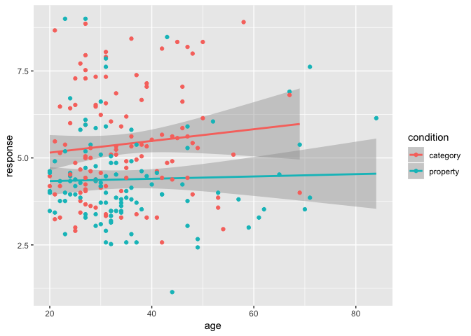
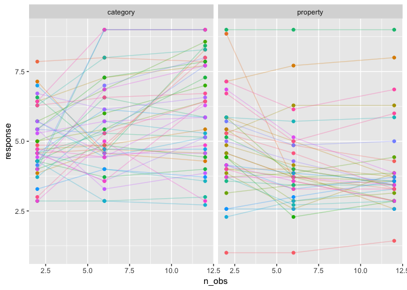
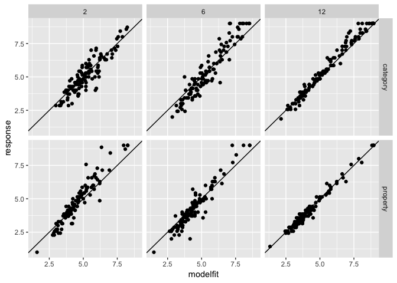
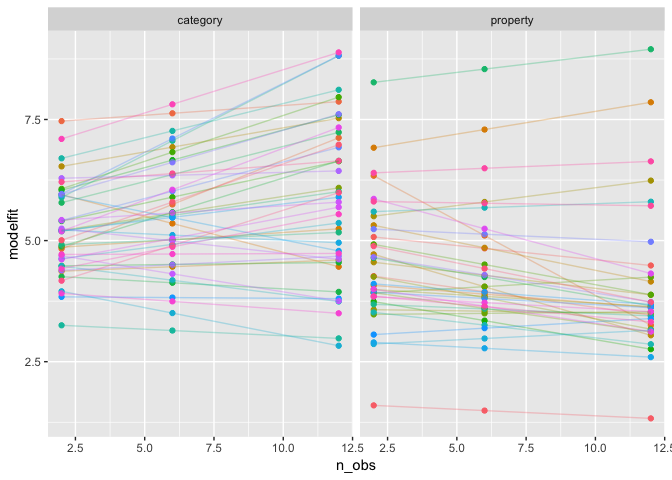
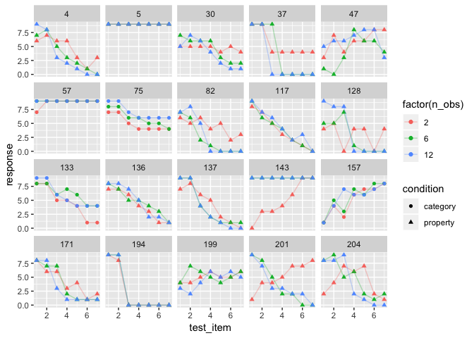
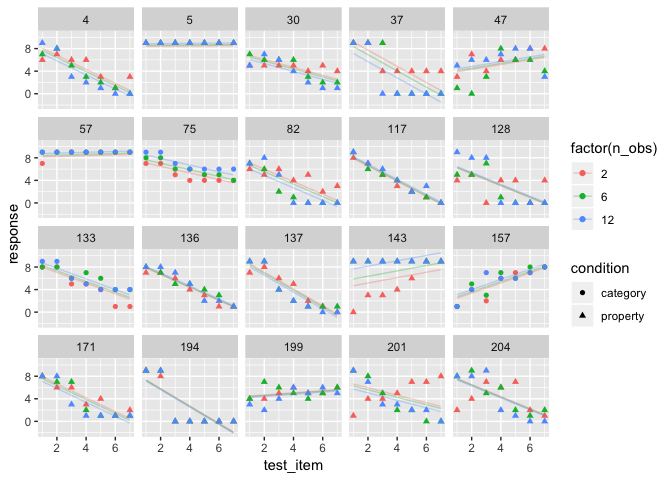
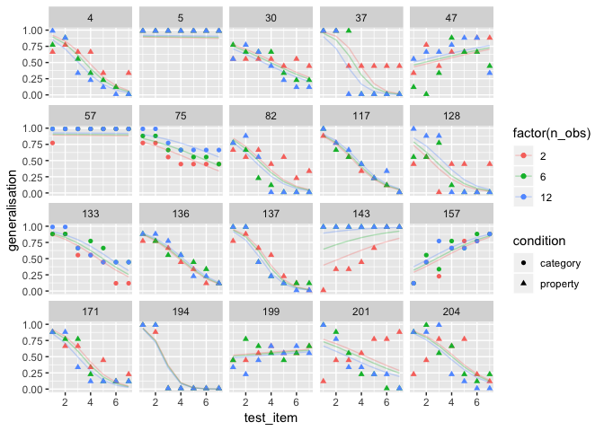
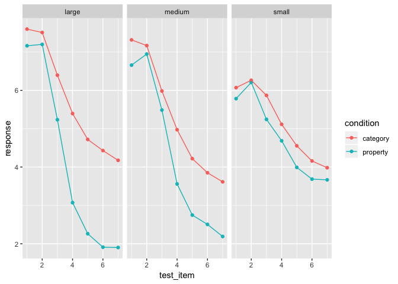
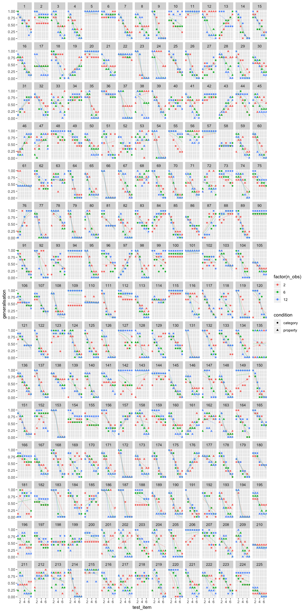

<h1 class="title toc-ignore display-3">
Linear models in R
</h1>
================
Danielle Navarro
5 December 2018

<!--

  html_document:
    includes:
      in_header: header.html
    theme: flatly
    highlight: textmate
    css: mystyle.css

-->
``` r
library(here)
```

    ## here() starts at /Users/dan/GitHub/chdss2018/day2_dataanalysis

``` r
library(tidyverse)
```

    ## ── Attaching packages ────────────────────────────── tidyverse 1.2.1 ──

    ## ✔ ggplot2 3.1.0     ✔ purrr   0.2.5
    ## ✔ tibble  1.4.2     ✔ dplyr   0.7.8
    ## ✔ tidyr   0.8.1     ✔ stringr 1.3.1
    ## ✔ readr   1.1.1     ✔ forcats 0.3.0

    ## ── Conflicts ───────────────────────────────── tidyverse_conflicts() ──
    ## ✖ dplyr::filter() masks stats::filter()
    ## ✖ dplyr::lag()    masks stats::lag()

``` r
library(lme4)
```

    ## Loading required package: Matrix

    ## 
    ## Attaching package: 'Matrix'

    ## The following object is masked from 'package:tidyr':
    ## 
    ##     expand

``` r
frames <- read_csv(here("analysis","data","frames_ex2.csv"))
```

    ## Parsed with column specification:
    ## cols(
    ##   id = col_integer(),
    ##   gender = col_character(),
    ##   age = col_integer(),
    ##   condition = col_character(),
    ##   sample_size = col_character(),
    ##   n_obs = col_integer(),
    ##   test_item = col_integer(),
    ##   response = col_integer()
    ## )

What this section is not
------------------------

Because R is a *statistical* programming language it comes with a lot of hypothesis tests and tools built in, and of course there is an overwhelming number of packages out there that extend this. It is impossible to cover the whole thing in a brief tutorial, so I'm going to be a little picky. For example, I'm going to skip over the most commonly used classical tests, because they're comparatively easy to learn and it's not the best use of our time! For future reference though:

-   The `t.test()` function handles one-sample, independent samples and paired samples t-tests
-   The `chisq.test()` function handles chi-square tests of independence and Pearson goodness of fit tests
-   The `prop.test()` function tests for the equality of two proportions.
-   The `binom.test()` function allows you to do a binomial test of choice proportion against a known rate
-   The `wilcox.test()` function handles one- and two-sample nonparametric tests of equality of means
-   The `cor.test()` function tests the significance of a correlation

Of course, there are many, many others! What we're going to focus on here is:

-   Linear modelling with the `lm()` function
-   Linear mixed models with the `lmer()` function (in the `lme4` package)
-   Generalised linear mixed models with the `glmer()` function (also from `lme4`)

Linear models
-------------

Linear models should be fairly familiar to most: it's essentially what we were all taught in undergraduate under the name multiple regression. However, what is sometimes underemphasised is the fact that correlation, ANOVA, and t-tests can all be cast within the linear modelling framework, and R allows you do do all these using the `lm()` function. So that's where we're going to start.

To begin with, we need a data set. For this purpose, let's construct a simplified version of the `frames` data, by averaging all the responses made by a person, regardless of the number of observations or the test item:

``` r
tinyframes <- frames %>%
  group_by(id, age, condition) %>%
  summarise(
    response = mean(response)
    ) %>%
  ungroup()
```

Let's take a look at the `tinyframes` dataset we've just created:

``` r
glimpse(tinyframes)
```

    ## Observations: 225
    ## Variables: 4
    ## $ id        <int> 1, 2, 3, 4, 5, 6, 7, 8, 9, 10, 11, 12, 13, 14, 15, 1...
    ## $ age       <int> 36, 46, 33, 71, 23, 31, 23, 31, 37, 46, 27, 30, 22, ...
    ## $ condition <chr> "category", "category", "property", "property", "pro...
    ## $ response  <dbl> 5.333333, 7.047619, 4.857143, 3.857143, 9.000000, 7....

A very typical way to produce descriptive statistics is to calculate mean and standard deviation for each condition, and count the number of people in each condition.

``` r
tinyframes %>%
  group_by(condition) %>%
  summarise(
    mean_resp = mean(response), 
    sd_resp = sd(response),
    n = n()
  )
```

    ## # A tibble: 2 x 4
    ##   condition mean_resp sd_resp     n
    ##   <chr>         <dbl>   <dbl> <int>
    ## 1 category       5.40    1.56   114
    ## 2 property       4.39    1.37   111

We would also want to visualise the data. It is almost always a mistake to start trying to model a data set without properly exploring it and making sure you have a good "feel" for what is going on. So let's draw a picture!

``` r
tinyframes %>% 
  ggplot(aes(x = age, y = response, colour = condition)) + 
  geom_smooth(method = "lm") + 
  geom_point()
```



Intuitively, it looks like the two conditions are likely to be different to one another; but if there's any effect of age it would have to be tiny.

### Using lm to do a t-test

So let's start with a simple question. Is there a "significant" difference between the two conditions? I'm not a fan of orthodox null hypothesis testing, to be honest, but it does have it's place. Traditionally, the solution is the t-test:

``` r
t.test(
  formula = response ~ condition, 
  data = tinyframes, 
  var.equal = TRUE
)
```

    ## 
    ##  Two Sample t-test
    ## 
    ## data:  response by condition
    ## t = 5.1625, df = 223, p-value = 5.388e-07
    ## alternative hypothesis: true difference in means is not equal to 0
    ## 95 percent confidence interval:
    ##  0.6259535 1.3988834
    ## sample estimates:
    ## mean in group category mean in group property 
    ##               5.397661               4.385242

Okay we have a significant difference. So we reject the null hypothesis (i.e., that the two groups have the same population mean) and accept the alternative (i.e., that they have different population means). Yay. I guess. The moment we start caring about data analysis in any detail, though, it helps to recast these "hypotheses" in terms of *statistical models*.

``` r
mod1 <- lm(formula = response ~ 1, data = tinyframes) 
mod2 <- lm(formula = response ~ condition, data = tinyframes)
```

To give you a sense of what R has just done, it has estimated the coefficients for two different regression models: `mod1` only includes an intercept term (i.e., the "grand mean"), wherese `mod2` contains two terms:

``` r
mod2
```

    ## 
    ## Call:
    ## lm(formula = response ~ condition, data = tinyframes)
    ## 
    ## Coefficients:
    ##       (Intercept)  conditionproperty  
    ##             5.398             -1.012

Notice that the coefficients have a clear relationship to the group means: the "intercept" term is identical to the group mean for category sampling, and the "conditionproperty" term is what you have to add to that to get the group mean for property sampling (i.e., 5.4 - 1.0 = 4.4). It's expressed in different language than the t-test, but `mod2` nevertheless maps onto the alternative hypothesis.

To compare these two linear models, we can call the `anova()` function:

``` r
anova(mod1, mod2)
```

    ## Analysis of Variance Table
    ## 
    ## Model 1: response ~ 1
    ## Model 2: response ~ condition
    ##   Res.Df    RSS Df Sum of Sq      F    Pr(>F)    
    ## 1    224 539.98                                  
    ## 2    223 482.33  1    57.645 26.652 5.388e-07 ***
    ## ---
    ## Signif. codes:  0 '***' 0.001 '**' 0.01 '*' 0.05 '.' 0.1 ' ' 1

This doesn't look like the output of a t-test, but if we look carefully we notice that:

-   The *p*-values are the same
-   The test statistics are related: $t = \\sqrt{F}$
-   The residual df in the ANOVA table is the same as the t-test df

In a sense, what we've just done is illustrate the fact that the Student t-test is equivalent to a one-way ANOVA with two groups (which we were all taught as undergraduates), but we've used linear models to do it!

Before moving on, I should mention that this is a slightly different ANOVA table than what you might be expecting to see. You can get the more traditional version like this,

``` r
anova(lm(response ~ condition, tinyframes))
```

    ## Analysis of Variance Table
    ## 
    ## Response: response
    ##            Df Sum Sq Mean Sq F value    Pr(>F)    
    ## condition   1  57.65  57.645  26.652 5.388e-07 ***
    ## Residuals 223 482.33   2.163                      
    ## ---
    ## Signif. codes:  0 '***' 0.001 '**' 0.01 '*' 0.05 '.' 0.1 ' ' 1

but it's essentially the same thing and I don't want to spend too much time on this since the focus is really on how we can extend these ideas.

### Mixing continuous and discrete predictors

One nice thing about linear models is that, because the framework is pretty general, there's nothing stopping you from including continuous variables and categorical variables in the same model (as one might do in an ANCOVA). So, sticking with out `tinyframes` data, perhaps we should check to see if we can detect an effect of age. It doesn't look very likely, but let's run the model anyway. What we'll do this time is take the same two models as before `mod1` and `mod2`, but now add a third model that includes `age` as an additional predictor:

``` r
mod3 <- lm(formula = response ~ condition + age, data = tinyframes)
```

If we take a quick look at the coefficients

``` r
mod3
```

    ## 
    ## Call:
    ## lm(formula = response ~ condition + age, data = tinyframes)
    ## 
    ## Coefficients:
    ##       (Intercept)  conditionproperty                age  
    ##          5.102572          -1.018548           0.008536

we can see that age really isn't having much of an effect, if any. To compare all three models using an *F*-test, what we would do is this:

``` r
anova(mod1, mod2, mod3)
```

    ## Analysis of Variance Table
    ## 
    ## Model 1: response ~ 1
    ## Model 2: response ~ condition
    ## Model 3: response ~ condition + age
    ##   Res.Df    RSS Df Sum of Sq       F    Pr(>F)    
    ## 1    224 539.98                                   
    ## 2    223 482.33  1    57.645 26.6544 5.399e-07 ***
    ## 3    222 480.12  1     2.214  1.0238    0.3127    
    ## ---
    ## Signif. codes:  0 '***' 0.001 '**' 0.01 '*' 0.05 '.' 0.1 ' ' 1

In this ANOVA table, what you're looking at is a test of `mod2` against `mod1`, followed by `mod3` against `mod2`. This suggests that `mod2` is preferred over `mod1` (reject the null), but `mod3` isn't preferred over `mod2` (retain the null).

### From hypothesis tests to model selection

I have a confession to make. I really dislike using null hypothesis tests the way we did in the previous analysis. Most of the framework for null hypothesis testing comes from work by Jerzy Neyman, and in his framework the goal is to *prespecify* a formal procedure such that you can input a data set, and output a binary decision; and specifically to ensure that this decision procedure controls your Type 1 error rate. This approach to statistics has its place, but it's not actually all that consistent with what we're doing here. Neyman's approach is completely automated: you *must* follow the procedure no matter what your data looks like, or else your Type 1 error isn't controlled. So if explore your data and they turn out to be super weird, you must apply your prespecified decision rule. If you don't not only is the p-value for this test completely meaningless, it also strongly invalidates any other p-values you report, even if you did stick to the procedure in those cases: because it implies that, had the data turned out some other way, you wouldn't have stuck to the procedure, and Neyman's theory only works if you *always* follow the prespecified analysis plan. No excuses, no exceptions.

In real life, this never actually happens. Science doesn't work that way. What I find bizarre, is that while statisticians for the most part have recognised that this presents a problem for Neyman's theory, there is a school of thought within psychology that the problem lies with the *scientist* for not adhering to this stupid statistical theory. Well, nuts to that. I have no particular interest in following Neyman's absurd rules, and my main goal as a scientist is something more akin to Ockham's razor: find the simplest model that provides an good enough account of the data.

In essence, what I've done here is reframed the statistical problem, and changed it from a "hypothesis testing" problem to a "model selection" problem. The tools used for model selection are often somewhat different, and the underlying philosophy is often more aligned with the Ockham's razor idea. Two (very simple, and often flawed) approaches to this are the Akaike information criterion (AIC) and the Bayesian information criterion (BIC), both of which have been around since the 1970s. For our linear models, we can evaluate them using the `AIC()` and `BIC()` functions:

``` r
AIC(mod1, mod2, mod3)
```

    ##      df      AIC
    ## mod1  2 839.4940
    ## mod2  3 816.0928
    ## mod3  4 817.0575

``` r
BIC(mod1, mod2, mod3)
```

    ##      df      BIC
    ## mod1  2 846.3262
    ## mod2  3 826.3411
    ## mod3  4 830.7219

Smaller values of AIC and BIC are better, and it's hardly a surprise that `mod2` turns out to be the best one!

### Exploring the model

Overall, `mod2` looks pretty sensible:

``` r
summary(mod2)
```

    ## 
    ## Call:
    ## lm(formula = response ~ condition, data = tinyframes)
    ## 
    ## Residuals:
    ##     Min      1Q  Median      3Q     Max 
    ## -3.2424 -0.9691 -0.3024  0.8052  4.6148 
    ## 
    ## Coefficients:
    ##                   Estimate Std. Error t value Pr(>|t|)    
    ## (Intercept)         5.3977     0.1377  39.187  < 2e-16 ***
    ## conditionproperty  -1.0124     0.1961  -5.163 5.39e-07 ***
    ## ---
    ## Signif. codes:  0 '***' 0.001 '**' 0.01 '*' 0.05 '.' 0.1 ' ' 1
    ## 
    ## Residual standard error: 1.471 on 223 degrees of freedom
    ## Multiple R-squared:  0.1068, Adjusted R-squared:  0.1027 
    ## F-statistic: 26.65 on 1 and 223 DF,  p-value: 5.388e-07

``` r
confint(mod2)
```

    ##                       2.5 %     97.5 %
    ## (Intercept)        5.126217  5.6691049
    ## conditionproperty -1.398883 -0.6259535

TODO:

-   the `predict()` function
-   the `residuals()` function
-   regression diagnostics using `plot()`

Example 1: A simple mixed model
-------------------------------

To get started with mixed models, we will look at a version of the `frames` data that is a little more complex than the `tinyframes` data from the last section, but not quite the full thing yet. Specifically, what we'll do is take the (within-subject) average responses across every `test_item`, but we *won't* average across the different values of `n_obs`. That gives us a `modestframes` data set:

``` r
modestframes <- frames %>% 
  group_by(id, age, condition, n_obs) %>%
  summarise(response = mean(response)) %>%
  ungroup()

glimpse(modestframes)
```

    ## Observations: 675
    ## Variables: 5
    ## $ id        <int> 1, 1, 1, 2, 2, 2, 3, 3, 3, 4, 4, 4, 5, 5, 5, 6, 6, 6...
    ## $ age       <int> 36, 36, 36, 46, 46, 46, 33, 33, 33, 71, 71, 71, 23, ...
    ## $ condition <chr> "category", "category", "category", "category", "cat...
    ## $ n_obs     <int> 2, 6, 12, 2, 6, 12, 2, 6, 12, 2, 6, 12, 2, 6, 12, 2,...
    ## $ response  <dbl> 5.857143, 5.285714, 4.857143, 5.285714, 7.571429, 8....

Let's start by building some possible models. The simplest model we might want to consider is one in which the population mean response is different from zero (i.e., a fixed effect for the intercept), but there is variation in the mean response across individuals (i.e., a random intercept for each participant). The model formula for this is written:

``` r
response ~ 1 + (1|id)
```

The first part of this model description `response ~ 1` is something we've seen before under linear models: it's the model that has an intercept but nothing else! Anything in parentheses `(1|id)` is a random effect term. In this case, we have a separate intercept for each person (i.e., each unique `id`). As an alternative, we might want to consider a model that includes fixed effects for the between-subject factor `condition` and the within-subject factor `n_obs`. The formula for that, expressed in `lme4` notation, is

``` r
response ~ 1 + condition + n_obs + (1|id)
```

In real life, we might want to also consider models that only contain one of these two fixed effects, but for simplicity I'm not going to bother with that here. Instead, let's jump straight to estimating these two models:

``` r
modest1 <- lmer(formula = response ~ 1 + (1|id), data = modestframes)
modest2 <- lmer(formula = response ~ condition + n_obs + (1|id), data = modestframes)
```

To compare them:

``` r
anova(modest1, modest2)
```

    ## refitting model(s) with ML (instead of REML)

    ## Data: modestframes
    ## Models:
    ## modest1: response ~ 1 + (1 | id)
    ## modest2: response ~ condition + n_obs + (1 | id)
    ##         Df    AIC    BIC  logLik deviance  Chisq Chi Df Pr(>Chisq)    
    ## modest1  3 2354.9 2368.5 -1174.5   2348.9                             
    ## modest2  5 2333.5 2356.1 -1161.8   2323.5 25.403      2  3.046e-06 ***
    ## ---
    ## Signif. codes:  0 '***' 0.001 '**' 0.01 '*' 0.05 '.' 0.1 ' ' 1

One thing that is nice about mixed models is that you can allow much more customisation than this. For instance, is it really all that plausible to think that everyone has a unique "random intercept" term, but is affected by the sample size in precisely the same way? That seems unlikely. To see this, let's plot the data for a random subset of 80 participants:

``` r
whichids <- sample(unique(modestframes$id), 80)
modestframes %>%
  filter(id %in% whichids) %>%
  ggplot(aes(x = n_obs, y = response, colour = factor(id))) +
  geom_point(show.legend = FALSE) + 
  geom_line(show.legend = FALSE, alpha = .3) + 
  facet_wrap(~ condition)
```



To my mind, it beggars belief to think that these lines are all supposed to have the same slope, so we should probably extend the model a bit. Let's suppose that everyone has their own "random slope" term (i.e., everyone has their own regression coefficient for the effect of sample size). That gives us this model:

``` r
modest3 <- lmer(formula = response ~ condition + n_obs + (1 + n_obs|id), data = modestframes)
```

Okay let's compare the expanded model to the model that only has a random intercept:

``` r
anova(modest2, modest3)
```

    ## refitting model(s) with ML (instead of REML)

    ## Data: modestframes
    ## Models:
    ## modest2: response ~ condition + n_obs + (1 | id)
    ## modest3: response ~ condition + n_obs + (1 + n_obs | id)
    ##         Df    AIC    BIC  logLik deviance  Chisq Chi Df Pr(>Chisq)    
    ## modest2  5 2333.5 2356.1 -1161.8   2323.5                             
    ## modest3  7 2270.4 2302.0 -1128.2   2256.4 67.164      2  2.603e-15 ***
    ## ---
    ## Signif. codes:  0 '***' 0.001 '**' 0.01 '*' 0.05 '.' 0.1 ' ' 1

Overall, it looks like this new model is providing a better account of the data, as evidenced by the lower AIC and BIC values. We can get a quantitative summary of how this model performs:

``` r
summary(modest3)
```

    ## Linear mixed model fit by REML ['lmerMod']
    ## Formula: response ~ condition + n_obs + (1 + n_obs | id)
    ##    Data: modestframes
    ## 
    ## REML criterion at convergence: 2267.9
    ## 
    ## Scaled residuals: 
    ##     Min      1Q  Median      3Q     Max 
    ## -2.8960 -0.3681 -0.0306  0.3557  3.3860 
    ## 
    ## Random effects:
    ##  Groups   Name        Variance Std.Dev. Corr 
    ##  id       (Intercept) 1.72618  1.3138        
    ##           n_obs       0.01684  0.1298   -0.21
    ##  Residual             0.55277  0.7435        
    ## Number of obs: 675, groups:  id, 225
    ## 
    ## Fixed effects:
    ##                     Estimate Std. Error t value
    ## (Intercept)        5.2256978  0.1385646  37.713
    ## conditionproperty -0.6693767  0.1874783  -3.570
    ## n_obs              0.0004094  0.0111058   0.037
    ## 
    ## Correlation of Fixed Effects:
    ##             (Intr) cndtnp
    ## cndtnprprty -0.667       
    ## n_obs       -0.311  0.000

Very nice. However, if we're thinking that we might be satisfied with this model, we should now start the process of "model criticism". Let's extract the fitted values ("predictions") and add them to the data frame:

``` r
modestframes$modelfit <- predict(modest3)
```

One very simple check is to draw a scatterplot showing the fitted (modelled) responses against the raw data. How closely do they resemble one another?

``` r
modestframes %>% 
  ggplot(aes(x = modelfit, y = response)) + 
  geom_point() + 
  facet_grid(condition ~ n_obs) + 
  geom_abline(intercept = 0, slope = 1)
```



They seem reasonably close to one another. There are hints of some systematic misfits near the edges of the response range, but nothing *too* terrible. To take a slightly closer look, let's plot the fitted values for the same 80 individuals we selected randomly earlier on:

``` r
modestframes %>%
  filter(id %in% whichids) %>%
  ggplot(aes(x = n_obs, y = modelfit, colour = factor(id))) +
  geom_point(show.legend = FALSE) + 
  geom_line(show.legend = FALSE, alpha = .3) + 
  facet_wrap(~ condition)
```



Overall this seems like a reasonable, though imperfect, approximation to what appears to be going on in the data.

TODO: - check residuals - interpret effects within the model - explain the underlying model

-   comment on REML vs ML: REML fits the fixed effects first, then estimates the random effects; whereas ML does them jointly. General advice is that you have to test fixed effects using the ML fits; to test random effects you can do it either way, but REML is generally preferred (for reasons).

Example 2: More complicated designs
-----------------------------------

At long last, we are at the point where we might be able to construct a sensible model for the *actual* `frames` data. To guide us in this process, let's plot the raw data for 20 randomly chosen subjects. This is pretty important, because each person is providing 21 responses that we expect to be related to one another in a systematic way, but we aren't completely sure what structure we'll find (okay, that's only half true - I did have some suspicions about what to expect, on the basis of substantive theory, but we aren't up to the cognitive modelling section of the summer school yet!) So let's take a look:

``` r
whichids <- sample(unique(frames$id), 20) 
frames %>%
  filter(id %in% whichids) %>%
  ggplot(aes(x = test_item, y = response, shape = condition, colour = factor(n_obs))) +
  geom_point() + 
  geom_line(alpha = .3) + 
  facet_wrap(~ id)
```



There's quite a variety of things there. None of these panels look like random responding, but it's immediately obvious from inspection that there are quite pronounced individual differences. It's not clear how well we're going to do by modelling these as linear functions, but let's give it a try and see how far we can get!

From the last exercise, we can be reasonably sure that there is a fixed effect of `condition` and `n_obs`, as well as random intercepts and slopes as a function of `n_obs`. So our starting point will be the model that came out of that modelling exercise, and -- for the sake of our sanity -- I'm only going to look at one alternative model, namely one that adds a fixed and random effect of `test_item` (mainly because it's kind of a foregone conclusion that these effects exist!)

``` r
linframes1 <- lmer(formula = response ~ condition + n_obs + (1 + n_obs|id), data = frames)
linframes2 <- lmer(formula = response ~ condition + test_item + (1 + test_item + n_obs|id), data = frames)
```

As before, we can call the `anova()` function to run some simple model comparisons:

``` r
anova(linframes1, linframes2)
```

    ## refitting model(s) with ML (instead of REML)

    ## Data: frames
    ## Models:
    ## linframes1: response ~ condition + n_obs + (1 + n_obs | id)
    ## linframes2: response ~ condition + test_item + (1 + test_item + n_obs | id)
    ##            Df   AIC   BIC   logLik deviance Chisq Chi Df Pr(>Chisq)    
    ## linframes1  7 23128 23173 -11556.8    23114                            
    ## linframes2 10 19732 19796  -9855.8    19712  3402      3  < 2.2e-16 ***
    ## ---
    ## Signif. codes:  0 '***' 0.001 '**' 0.01 '*' 0.05 '.' 0.1 ' ' 1

I personally prefer to rely on BIC over *p*-values or AIC, but realistically none of them are ideal, and in any case the differences in model performance are so extreme it doesn't matter what you use. They all give the same answer. So now let's take a closer look at the model performance:

``` r
summary(linframes2)
```

    ## Linear mixed model fit by REML ['lmerMod']
    ## Formula: response ~ condition + test_item + (1 + test_item + n_obs | id)
    ##    Data: frames
    ## 
    ## REML criterion at convergence: 19720.7
    ## 
    ## Scaled residuals: 
    ##     Min      1Q  Median      3Q     Max 
    ## -5.1775 -0.5141  0.0274  0.5604  3.3037 
    ## 
    ## Random effects:
    ##  Groups   Name        Variance Std.Dev. Corr       
    ##  id       (Intercept) 7.39777  2.7199              
    ##           test_item   0.48680  0.6977   -0.88      
    ##           n_obs       0.01973  0.1404   -0.52  0.37
    ##  Residual             2.80264  1.6741              
    ## Number of obs: 4725, groups:  id, 225
    ## 
    ## Fixed effects:
    ##                   Estimate Std. Error t value
    ## (Intercept)        7.97038    0.18493  43.100
    ## conditionproperty -0.61921    0.16837  -3.678
    ## test_item         -0.69197    0.04583 -15.097
    ## 
    ## Correlation of Fixed Effects:
    ##             (Intr) cndtnp
    ## cndtnprprty -0.449       
    ## test_item   -0.769  0.000

The correlation term here deserves some explanation \[TODO\]

Add the model fits and residuals

``` r
linframes <- frames
linframes$modelfit <- predict(linframes2)
linframes$residuals <- residuals(linframes2)
```

Now that we have a model, let's see how well it holds up under a good old-fashioned eyeball test. Here are the model predictions (lines) plotted against the raw ata for the same 20 participants:

``` r
linframes %>%
  filter(id %in% whichids) %>%
  ggplot(aes(x = test_item, y = response, shape = condition, colour = factor(n_obs))) +
  geom_point() + 
  geom_line(aes(y = modelfit), alpha = .3) + 
  facet_wrap(~ id)
```



It's okay, I guess, but a little less than ideal. There are some clear nonlinearities in the data. At the individual-subject level, some responses look linear, others look S-shaped, and others look curvilinear. It would be nice to capture this in the model.

Generalised linear mixed models
-------------------------------

``` r
glmerframes <- frames %>% mutate(generalisation = (response+.1)/9.2)
```

``` r
logitmod <- glmer(
  formula = generalisation ~ condition + test_item + n_obs + (1 + test_item + n_obs|id), 
  family = gaussian(link = "logit"), 
  data = glmerframes)
```

    ## Warning in checkConv(attr(opt, "derivs"), opt$par, ctrl =
    ## control$checkConv, : Model failed to converge with max|grad| = 1.71494 (tol
    ## = 0.001, component 1)

For comparison, lets fit this model with a linear link function (i.e., same model as last time, but using the rescaled data)

``` r
linearmod <- lmer(
  formula = generalisation ~ condition + test_item + n_obs + (1 + test_item + n_obs|id), 
  data = glmerframes)
```

Comparing models?

``` r
anova(linearmod, logitmod)
```

    ## refitting model(s) with ML (instead of REML)

    ## Data: glmerframes
    ## Models:
    ## linearmod: generalisation ~ condition + test_item + n_obs + (1 + test_item + 
    ## linearmod:     n_obs | id)
    ## logitmod: generalisation ~ condition + test_item + n_obs + (1 + test_item + 
    ## logitmod:     n_obs | id)
    ##           Df     AIC     BIC  logLik deviance  Chisq Chi Df Pr(>Chisq)    
    ## linearmod 11 -1237.9 -1166.9  629.96  -1259.9                             
    ## logitmod  11 -2741.5 -2670.4 1381.73  -2763.5 1503.5      0  < 2.2e-16 ***
    ## ---
    ## Signif. codes:  0 '***' 0.001 '**' 0.01 '*' 0.05 '.' 0.1 ' ' 1

Again, all three criteria (AIC, BIC, *p*-values if you absolutely must) lead to the same conclusion, namely that the nonlinear model provides the better account of people's responses. As usual, we should take a good look at what the model is actually doing before we accept anything:

``` r
glmerframes$modelfit <- predict(logitmod, type="response")
glmerframes$residuals <- residuals(logitmod, type="response")

glmerframes %>%
  filter(id %in% whichids) %>%
  ggplot(aes(x = test_item, y = generalisation, shape = condition, colour = factor(n_obs))) +
  geom_point() + 
  geom_line(aes(y = modelfit), alpha = .3) + 
  facet_wrap(~ id)
```



Okay, at long last I'm "happy". It's not a perfect model but it's good enough that we can use it to test for "effects":

``` r
summary(logitmod)
```

    ## Generalized linear mixed model fit by maximum likelihood (Laplace
    ##   Approximation) [glmerMod]
    ##  Family: gaussian  ( logit )
    ## Formula: 
    ## generalisation ~ condition + test_item + n_obs + (1 + test_item +  
    ##     n_obs | id)
    ##    Data: glmerframes
    ## 
    ##      AIC      BIC   logLik deviance df.resid 
    ##  -2741.5  -2670.4   1381.7  -2763.5     4714 
    ## 
    ## Scaled residuals: 
    ##     Min      1Q  Median      3Q     Max 
    ## -5.2697 -0.4241  0.0384  0.4929  3.4459 
    ## 
    ## Random effects:
    ##  Groups   Name        Variance Std.Dev. Corr       
    ##  id       (Intercept) 2.216628 1.48883             
    ##           test_item   0.145355 0.38125  -0.86      
    ##           n_obs       0.008568 0.09256  -0.56  0.25
    ##  Residual             0.033600 0.18330             
    ## Number of obs: 4725, groups:  id, 225
    ## 
    ## Fixed effects:
    ##                   Estimate Std. Error t value Pr(>|z|)    
    ## (Intercept)        4.01522    0.30558  13.140   <2e-16 ***
    ## conditionproperty -0.48466    0.18185  -2.665   0.0077 ** 
    ## test_item         -0.99181    0.08175 -12.133   <2e-16 ***
    ## n_obs             -0.01351    0.01551  -0.871   0.3837    
    ## ---
    ## Signif. codes:  0 '***' 0.001 '**' 0.01 '*' 0.05 '.' 0.1 ' ' 1
    ## 
    ## Correlation of Fixed Effects:
    ##             (Intr) cndtnp tst_tm
    ## cndtnprprty -0.346              
    ## test_item   -0.848  0.018       
    ## n_obs       -0.556  0.081  0.332
    ## convergence code: 0
    ## Model failed to converge with max|grad| = 1.71494 (tol = 0.001, component 1)

It's taken us a while, but I think we're now at the stage where we could reasonably claim that there are genuine effects of test item and sampling condition. It's less clear whether there is an effect of sample size.

### Data visualisation... it matters!

Remember this?

``` r
frames %>%
  group_by(condition, sample_size, test_item) %>%
  summarise(response = mean(response)) %>%
  ggplot(aes(x = test_item, y = response, colour = condition)) +
  geom_point() +
  geom_line() +
  facet_wrap(~sample_size)
```



Why am I fitting this model without interaction terms? Just eyeballing the mean response it's really clear that there is a three-way interaction here. The difference between property sampling and category sampling increases as a function of sample size, but *only* for the distant test items.

The answer:

``` r
kitchensink <- glmer(
  formula = generalisation ~ condition * test_item * n_obs + (1 + test_item * n_obs|id), 
  family = gaussian(link = "logit"), 
  data = glmerframes)
```

    ## Warning in (function (fn, par, lower = rep.int(-Inf, n), upper =
    ## rep.int(Inf, : failure to converge in 10000 evaluations

    ## Warning in checkConv(attr(opt, "derivs"), opt$par, ctrl =
    ## control$checkConv, : Model failed to converge with max|grad| = 1.05812 (tol
    ## = 0.001, component 1)

Yeah, this is not a happy place to be. Once your model gets this complicated, be prepared for bad things to happen. Nevertheless, let's take a quick check and see if this model is better:

``` r
anova(logitmod, kitchensink)
```

    ## Data: glmerframes
    ## Models:
    ## logitmod: generalisation ~ condition + test_item + n_obs + (1 + test_item + 
    ## logitmod:     n_obs | id)
    ## kitchensink: generalisation ~ condition * test_item * n_obs + (1 + test_item * 
    ## kitchensink:     n_obs | id)
    ##             Df     AIC     BIC logLik deviance  Chisq Chi Df Pr(>Chisq)
    ## logitmod    11 -2741.5 -2670.4 1381.7  -2763.5                         
    ## kitchensink 19 -3950.7 -3828.0 1994.3  -3988.7 1225.2      8  < 2.2e-16
    ##                
    ## logitmod       
    ## kitchensink ***
    ## ---
    ## Signif. codes:  0 '***' 0.001 '**' 0.01 '*' 0.05 '.' 0.1 ' ' 1

Yep. Even though we're having horrible problems getting the bloody thing to converge (so our estimates are probably all a bit wrong), it's *still* providing a vastly superior fit to the last one. Well, let's take a look...

``` r
glmerframes2 <- glmerframes
glmerframes2$modelfit <- predict(kitchensink, type="response")
glmerframes2$residuals <- residuals(kitchensink, type="response")

glmerframes2 %>%
  #filter(id %in% whichids) %>%
  ggplot(aes(x = test_item, y = generalisation, shape = condition, colour = factor(n_obs))) +
  geom_point() + 
  geom_line(aes(y = modelfit), alpha = .3) + 
  facet_wrap(~ id)
```



Yeah, that's actually better. The eyeball test again agrees with AIC, BIC and even the humble *p*-value. This model does a much better job of fitting the data in the experiment.

So now let's use the `summary()` function to take a look at the model coefficients and the "standard" tests of significance:

``` r
summary(kitchensink)
```

    ## Generalized linear mixed model fit by maximum likelihood (Laplace
    ##   Approximation) [glmerMod]
    ##  Family: gaussian  ( logit )
    ## Formula: 
    ## generalisation ~ condition * test_item * n_obs + (1 + test_item *  
    ##     n_obs | id)
    ##    Data: glmerframes
    ## 
    ##      AIC      BIC   logLik deviance df.resid 
    ##  -3950.7  -3828.0   1994.4  -3988.7     4706 
    ## 
    ## Scaled residuals: 
    ##     Min      1Q  Median      3Q     Max 
    ## -5.8127 -0.3859  0.0558  0.4859  3.3474 
    ## 
    ## Random effects:
    ##  Groups   Name            Variance Std.Dev. Corr             
    ##  id       (Intercept)     1.859838 1.36376                   
    ##           test_item       0.129752 0.36021  -0.88            
    ##           n_obs           0.045449 0.21319  -0.40  0.34      
    ##           test_item:n_obs 0.004104 0.06406   0.19 -0.25 -0.87
    ##  Residual                 0.026721 0.16347                   
    ## Number of obs: 4725, groups:  id, 225
    ## 
    ## Fixed effects:
    ##                                   Estimate Std. Error t value Pr(>|z|)    
    ## (Intercept)                        1.85672    0.32072   5.789 7.07e-09 ***
    ## conditionproperty                 -0.01594    0.40223  -0.040 0.968380    
    ## test_item                         -0.41441    0.09195  -4.507 6.57e-06 ***
    ## n_obs                              0.40408    0.05207   7.761 8.43e-15 ***
    ## conditionproperty:test_item       -0.03293    0.11816  -0.279 0.780497    
    ## conditionproperty:n_obs            0.10659    0.05717   1.865 0.062251 .  
    ## test_item:n_obs                   -0.10628    0.01871  -5.681 1.34e-08 ***
    ## conditionproperty:test_item:n_obs -0.07719    0.02095  -3.685 0.000229 ***
    ## ---
    ## Signif. codes:  0 '***' 0.001 '**' 0.01 '*' 0.05 '.' 0.1 ' ' 1
    ## 
    ## Correlation of Fixed Effects:
    ##                (Intr) cndtnp tst_tm n_obs  cndtnprprty:t_ cndtnprprty:n_
    ## cndtnprprty    -0.613                                                   
    ## test_item      -0.898  0.557                                            
    ## n_obs          -0.140 -0.009  0.098                                     
    ## cndtnprprty:t_  0.544 -0.893 -0.617  0.042                              
    ## cndtnprprty:n_  0.023 -0.147  0.003 -0.576  0.094                       
    ## tst_tm:n_bs    -0.095  0.159  0.054 -0.886 -0.142          0.544        
    ## cndtnpr:_:_     0.151 -0.108 -0.124  0.536  0.073         -0.856        
    ##                tst_:_
    ## cndtnprprty          
    ## test_item            
    ## n_obs                
    ## cndtnprprty:t_       
    ## cndtnprprty:n_       
    ## tst_tm:n_bs          
    ## cndtnpr:_:_    -0.673
    ## convergence code: 0
    ## Model failed to converge with max|grad| = 1.05812 (tol = 0.001, component 1)
    ## failure to converge in 10000 evaluations

Uh huh. What the hell does any of this mean??!? I mean, it's the same output we've seen at every previous step in the process, but now it just looks like an arbitrary collection of asterisks and numbers.

To my mind, the only part of this output that matters is this one line, highlighting the fact that yes, once you put together a proper model that accounts for individual differences and can match the structure of the data reasonably well, there is indeed a three way interaction. Everything matters (except totally irrelevant stuff like age and the colour of the wallpaper) and everything interacts with everything else:

    ## conditionproperty:test_item:n_obs -0.07719    0.02095  -3.685 0.000229 ***

If you want to get more out of the data than this, statistics won't help you any more. You're going to have to try doing some psychology, I'm afraid...

THE BIGGEST LESSON
------------------

If I were exploring the data without the guide of substantive theory and with no proper cognitive model to tell me where to look next, I would be *very* wary of going any further. Blindly trying to make sense of three-way interaction effects is a terrible idea, and you'll end up chasing shadows. Nothing -- and I repeat, **NOTHING** -- in what we have done so far, is "theory". Yes, what we have here is a "model" in the sense that statisticians refer to a model, but it is *not* a cognitive model in the sense that any psychologist would care about. It is not constrained by any notion of how people are solving the reasoning problem. There is no substance here: it is purely data analysis. One of the big traps that psychologists have fallen for, time and time again over the last century, is believing that statistical models can provide a substitute for theory. Call it the *psychometric fallacy* if you will.

Tomorrow, Charles will talk more about what actually does constitute theory!
