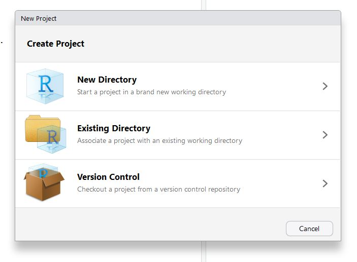

Working with RStudio projects
================
Danielle Navarro
11 December 2018

At this point in setting up our project, we have a git repository that can handle version control, help collaborate with others and (in the long run) allow other people to make use of our work. However, that's just background infrastructure. The next thing we need to take care of is how we're going to organise the files and *in* the project, and how we're going to structure our data analysis to be readable to others. This is where RStudio projects an R Markdown can both be helpful...

RStudio projects
----------------

The core idea behind an [RStudio project](https://support.rstudio.com/hc/en-us/articles/200526207-Using-Projects) is, to use their words...

> make it straightforward to divide your work into multiple contexts, each with their own working directory, workspace, history, and source documents

It's pretty simple in a way. Normally, R keeps track of various different events that have happened in your previous work, but it has no idea which events are associated with which "project". An RStudio project creates a `.Rproj` file that links the different scripts, data sets, etc within a particular folder on your computer. So, why work in projects? As I see it, there are two kinds of reason, both of which are valid:

-   *Convenience*. By working in projects, RStudio will help you keep things tidy, and it smooths the process in many ways.
-   *Functionality.* The fact that RStudio projects leave a `.Rproj` file located at the "root" of your project serves as a useful anchor for other packages. For instance, there are packages (e.g., the `here` package) that can detect the `.Rproj` file and allow you to define the location of files relative to the project root. This is *incredibly* useful when sharing your code with other people!

### Creating a project

The process is pretty simple. Go to the the little blue menu in the top the top right corner in RStudio, click on the dropdown menu, and select "New Project".

This will bring up a dialog box that provides a few different optons. Because we're going to work in the existing folder that we created for the git tutorial (`summerschool`), select "existing directory" and then browse for the correct location.

 

Once you've created the project, if you have a look at the folder in Windows Explorer / Mac Finder, you'll see a new file called `summerschool.Rproj`:

Done. You now have an RStudio project. Any time you want to switch between projects, use the drop down menu. RStudio will automatically change the working directory, start a new R session for you, and open up whatever files you had open last time you were using it.

Creating the structure for our project:
---------------------------------------

-   experiment (stuff from day 1)
-   analysis (today!!)
-   models (stuff from day 3)

The analysis folder we'll subdivide into two folders:

-   data
-   docs

In real life, the data that you'd start with in the data folder would be very messy and require some advanced data wrangling skills, but we're not there yet so let's jump forward in time and add a "tidy" data set. The [frames data](http://compcogscisydney.org/psyr/data/frames_ex2.csv) corresponds to Experiment 2 from a paper by Hayes et al (still under review), and it's an inductive generalisation task similar to the one Amy walked you through on Day 1. We'll talk more about the data later. For now, save this file to the `data` folder.

R Markdown documents
--------------------

Until now our code has been written in *scripts*, and our documentation has been written using *markdown*. Both are nice things to have - scripts are good for organising your R commands, and markdown is an efficient way to write commentaries and notes.

Wouldn't it be nice to have some way to do both of these things in a single document? Yes of course it would. Enter R Markdown!

To create an R Markdown document use the Rstudio file menu:

Then give your document a title (and choose output type, which we'll assume to be HTML).

This creates untitled R Markdown document in the source pane:

Save it to the `docs` folder, with the name `exploration.Rmd`. So now you have this:

Click on the `Knit` button to see what happens

### Structure of an R Markdown document

-   the bit at the top is the "yaml header" (ignore it for now)
-   anything shaded in grey (between the backticks) is a *code chunk* and is treated just like an R script
-   anything in white treated like Markdown.

Play around with this for a bit! Get a feel for how it works, then delete everything after line 10 (i.e., leave the header, and the first code chunk). Now we're ready to go!
