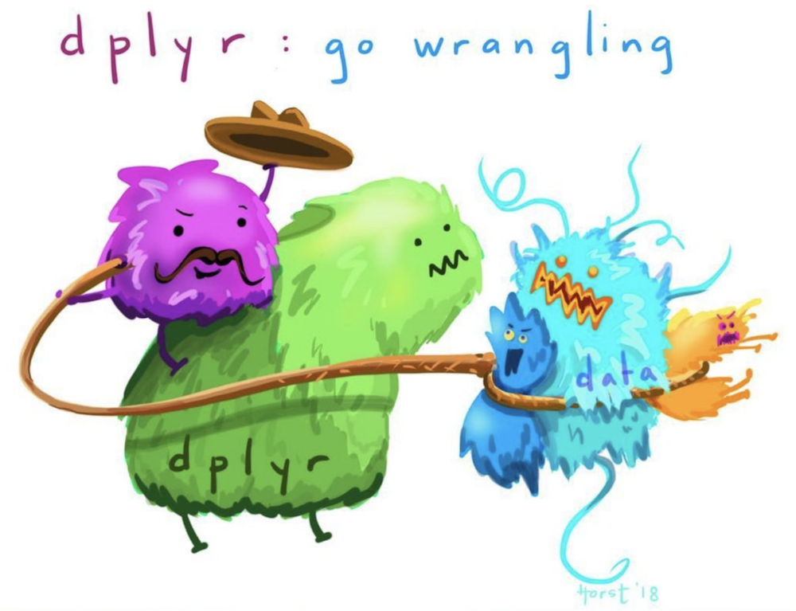
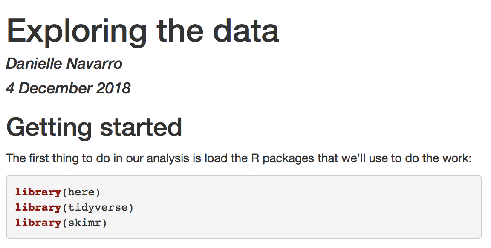
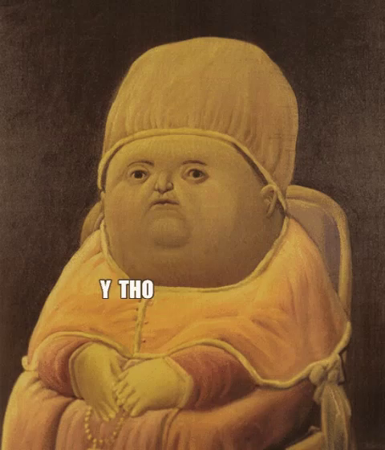
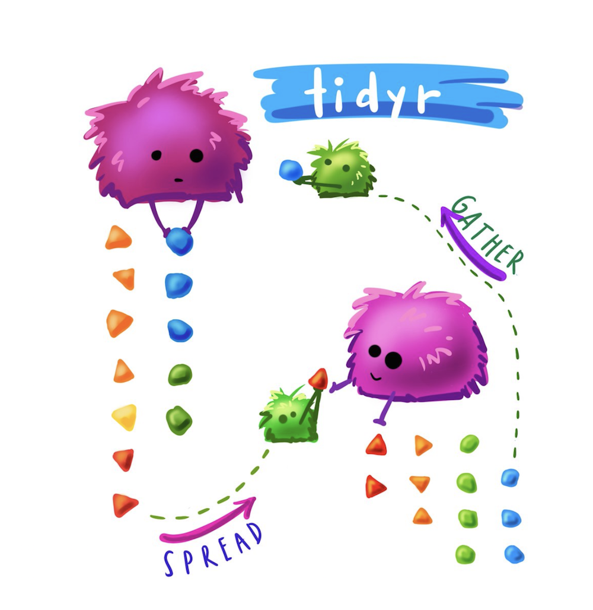

```{r setup, include=FALSE, message = FALSE}
options(htmltools.dir.version = FALSE)
library(here)
library(tidyverse)
library(skimr)
frames <- read_csv(here("analysis","data","frames_ex2.csv"))
```


class: bg-main1 center middle hide-slide-number

.reveal-text.bg-main2[.pad1[
.font4[Data wrangling]
]]


<!-- *********** NEW SLIDE ************** -->
---
class: split-two bg-main1

.column.bg-main1[.content.vmiddle.center[

# Data wrangling

<br>

.pull.left[.pad1[

### .orange[**What?**] Manipulate data
### .orange[**Why?**] Because data are messy
### .orange[**How?**] With tidyverse! (esp. dplyr)

]]

]]

--
.column.bg-main3[.content.vmiddle.center[



[@allison_horst](https://twitter.com/allison_horst)

]]


<!-- *********** NEW SLIDE ************** -->
---

class: bg-main1 center middle hide-slide-number

.reveal-text.bg-main2[.pad1[
.font4[The "sampling frames" experiment]
]]


<!-- *********** NEW SLIDE ************** -->
---

class: bg-main1 center middle

# Property sampling: the robot only detects plaxium spheres
<br>

<br>


<!-- *********** NEW SLIDE ************** -->
---

class: bg-main1 center middle

# Category sampling: the robot only tests small spheres
<br>

<br>


<!-- *********** NEW SLIDE ************** -->
---

class: bg-main1 center middle

# Small sample size: Elicit judgments after two observations
<br>

<br>

<!-- *********** NEW SLIDE ************** -->
---

class: bg-main1 center middle

# Medium sample size: Elicit judgments after six observations
<br>

<br>

<!-- *********** NEW SLIDE ************** -->
---

class: bg-main1 center middle

# Large sample size: Elicit judgments after twelve observations
<br>

<br>


<!-- *********** NEW SLIDE ************** -->
---

class: bg-main1 center middle

# Seven test items that vary in size: Smallest...
<br>

<br>

<!-- *********** NEW SLIDE ************** -->
---

class: bg-main1 center middle

# Seven test items that vary in size: Largest...
<br>

<br>

<!-- NEW SLIDE -->
---
class: bg-main1 center middle hide-slide-number

.reveal-text.bg-main2[.pad1[
.font4[Getting started]
]]


<!-- *********** NEW SLIDE ************** -->
---
class: bg-main1

# What do we need?

<br>

.pull.left[.pad1[.font2[

- General resources: https://djnavarro.github.io/chdss2018/
- The data: http://compcogscisydney.org/psyr/data/frames_ex2.csv
- Save data here: [your_project]/analysis/data/frames_ex2.csv
- R packages:
```{r, eval=FALSE}
install.packages("tidyverse")
install.packages("skimr")
install.packages("lsr")
```
]]]


<!-- *********** NEW SLIDE ************** -->
---
class: split-40 bg-main1

.row.bg-main1[.content.vmiddle.center[

# An R Markdown document!

.pull.left[.pad1[.font2[
- File > New File > R Markdown...
- Save it: [your_project]/analysis/docs/analysis.Rmd
]]]

]]

.row.bg-main3[.content.vmiddle.center[


]]]
]]


<!-- *********** NEW SLIDE ************** -->
---
class: split-40 bg-main1

.column.bg-main1[.content.vmiddle.center[

# Delete everything except the top bit

.pull.left[.pad1[.font2[
- At the top is the YAML header
- Leave the knitr thing alone
- This is the whole document...
]]]

]]

.column.bg-main3[.content.vmiddle.center[

.pull.left[.pad1[.font2[

````
---
title: "Exploring the data"
author: "Danielle Navarro"
date: "4 December 2018"
output: html_document
---

```{r setup, include=FALSE}`r ''`
knitr::opts_chunk$set(echo = TRUE)
```
````

]]]
]]


<!-- *********** NEW SLIDE ************** -->
---
class: split-40 bg-main1

.column.bg-main1[.content.vmiddle.center[

# Start writing!

.pull.left[.pad1[.font2[
- Load packages in the first chunk
- Write **descriptions for humans!**
- Document, document, document
]]]

]]

--
.column.bg-main3[.content.vmiddle.center[

.pull.left[.pad1[.font2[

````
## Getting started

The first thing to do in our analysis is load the R
packages that we'll use to do the work:

```{r}`r ''`
library(here)
library(tidyverse)
library(skimr)
```

The next step is to load the data set itself. The data 
from the sampling frames experiment are stored in the 
"frames_ex2.csv" file:

```{r}`r ''`
loc <- here("analysis","data","frames_ex2.csv")
frames <- read_csv(file = loc)
```
````

]]]
]]


<!-- *********** NEW SLIDE ************** -->
---
class: split-40 bg-main1

.column.bg-main1[.content.vmiddle.center[

# Click the knit button!

.pull.left[.pad1[.font2[
]]]

]]
--
.column.bg-main3[.content.vmiddle.center[


]]


<!-- *********** NEW SLIDE ************** -->
---
class: split-40 bg-main1

.column.bg-main1[.content.vmiddle.center[

# Tidy the code chunk

.pull.left[.pad1[.font2[
- Note the output messages
- Helpful the first time...
- ... but suppress if you like
- Give it a name (like packageload)
]]]
]]
--
.column.bg-main3[.content.vmiddle.center[
.pull.left[.pad1[.font2[
````
## Getting started

The first thing to do in our analysis is load the R
packages that we'll use to do the work:

```{r packageload, message=FALSE}`r ''`
library(here)
library(tidyverse)
library(skimr)
```
````
]]]

]]


<!-- *********** NEW SLIDE ************** -->
---
class: split-40 bg-main1

.column.bg-main1[.content.vmiddle.center[

# Tidy the code chunk

.pull.left[.pad1[.font2[
- Note the output messages
- Helpful the first time...
- ... but suppress if you like
- Give it a name (like packageload)

]]]

]]

.column.bg-main3[.content.vmiddle.center[



]]


<!-- *********** NEW SLIDE ************** -->
---
class: split-40 bg-main1

.column.bg-main1[.content.vmiddle.center[

# Import the data

.pull.left[.pad1[.font2[
- Verbal description
- Specify the file location
- Import data with read_csv()
]]]
]]

--
.column.bg-main3[.content.vmiddle.center[
.pull.left[.pad1[.font2[

````
The next step is to load the data set itself. The data 
from the sampling frames experiment are stored in the 
"frames_ex2.csv" file:

```{r dataimport}`r ''`
loc <- here("analysis","data","frames_ex2.csv")
frames <- read_csv(file = loc)
```
````

]]]
]]


<!-- *********** NEW SLIDE ************** -->
---
class: split-40 bg-main1

.column.bg-main1[.content.vmiddle.center[

# Import the data

.pull.left[.pad1[.font2[
- Verbal description
- Specify the file location
- Import data with read_csv()
- And click "knit!"
]]]

]]

.column.bg-main3[.content.vmiddle.center[


]]


<!-- *********** NEW SLIDE ************** -->
---
class: split-40 bg-main1

.column.bg-main1[.content.vmiddle.center[

# Inspect the data set

.pull.left[.pad1[.font2[
- Data as a "tibble" (data frame)
- Printing it shows the structure
- The glimpse() function is nice
- Name *every* code chunk!
]]]

]]

.column.bg-main3[.content.vmiddle.center[

.pull.left[.pad1[.font2[

````
The data set has been imported as a tibble. Let's take 
a quick look at the data. Each row in the data set is
a single response, and each column is a variable:

```{r printframes}`r ''`
frames
```

An alternative way to view the a tibble that sometimes
looks nicer is to use the `glimpse()` function:

```{r glimpseframes}`r ''`
glimpse(frames)
```
````

]]]
]]


<!-- *********** NEW SLIDE ************** -->
---
class: split-40 bg-main1

.column.bg-main1[.content.vmiddle.center[

# Inspect the data set

.pull.left[.pad1[.font2[
- Data as a "tibble" (data frame)
- Printing it shows the structure
- The glimpse() function is nice
- Name *every* code chunk!
]]]

]]

.column.bg-main3[.content.vmiddle.center[


]]


<!-- *********** NEW SLIDE ************** -->
---
class: split-40 bg-main1

.column.bg-main1[.content.vmiddle.center[

# "Skim" the data

.pull.left[.pad1[.font2[
- Use skimr::skim
- Means, std dev., quantiles
- Also cute text histograms
]]]
]]

.column.bg-main3[.content.vmiddle.center[
.pull.left[.pad1[.font2[
````
Finally, as a quick first pass, we can use the `skim()`
function to get a simple overview of each variable:

```{r skimframes}`r ''`
skim(frames)
```
````

]]]
]]


<!-- *********** NEW SLIDE ************** -->
---
class: split-40 bg-main1

.column.bg-main1[.content.vmiddle.center[

# "Skim" the data

.pull.left[.pad1[.font2[
- Use skimr::skim
- Means, std dev., quantiles
- Also cute text histograms
]]]
]]

.column.bg-main3[.content.vmiddle.center[


]]


<!-- *********** NEW SLIDE ************** -->
---

class: center middle hide-slide-number

.pad1[
.font4[Wrangling Exercise #1]
]


<!-- *********** NEW SLIDE ************** -->
---

class: bg-main1 center middle hide-slide-number

.reveal-text.bg-main2[.pad1[
.font4[A tiny warning about R]
]]


<!-- *********** NEW SLIDE ************** -->
---
class: split-40 bg-main1

.column.bg-main1[.content.vmiddle.center[
.pull.left[.pad1[.font2[
# R is tricksy

- Suppose `x = 10`
- Suppose I call `plot(x)`
- What does R "pass" to `plot`? 
- I said: the number `10`. But I lied.
- It actually sends the "unevaluated expression" `x` that evaluates to the number `10`. 
- Functions can capture & modify the expression *before* it gets evaluated 
]]]
]]
--
.column.bg-main3[.content.vmiddle.center[
.pull.left[.pad1[.font2[
```{r, eval=TRUE}
# simple example
textify <- function(...) {
  y <- deparse(match.call())
  return(y)
}

# let's try it
txt <- textify(what,the,f**k)

# hm.
print(txt)
```

]]]
]]


<!-- *********** NEW SLIDE ************** -->
---

class: split-two bg-main1

.column.bg-main1[.content.vmiddle.center[

# Tidyverse packages do it a lot

.pull.left[.font2[.pad1[
- dplyr
- ggplot2
- readr
- tidyr
- purrr
- etc

]]]
]]
--
.column.bg-main3[.content.vmiddle.center[

# Beware!


<!---->

]]

<!-- *********** NEW SLIDE ************** -->
---

class: bg-main1 center middle hide-slide-number

.reveal-text.bg-main2[.pad1[
.font4[Introducing the pipe, %>%]
]]


<!-- *********** NEW SLIDE ************** -->
---
class: split-40 bg-main1

.column.bg-main1[.content.vmiddle.center[

# The pipe, %>%

.pull.left[.pad1[.font2[
- Take the frames data...
- Do one thing...
- Then another...
- And then one more...
]]]
]]
--
.column.bg-main3[.content.vmiddle.center[
.pull.left[.pad1[.font2[
```{}
frames %>%
  do_one_thing(.) %>%
  then_another(.) %>%
  and_then_one_more(.)
```

]]]
]]


<!-- *********** NEW SLIDE ************** -->
---
class: split-two bg-main1

.column.bg-main1[.content.vmiddle.center[
.pull.left[.pad1[.font2[

# Regular code

```{}
do_one_thing(frames) 
```

]]]
]]
--
.column.bg-main3[.content.vmiddle.center[
.pull.left[.pad1[.font2[

# The piped version

```{}
frames %>% do_one_thing() 
```

]]]
]]


<!-- *********** NEW SLIDE ************** -->
---
class: split-two bg-main1

.column.bg-main1[.content.vmiddle.center[
.pull.left[.pad1[.font2[

# Regular code

```{}
then_another(
  do_one_thing(
    frames
  ) 
)
```

]]]
]]

.column.bg-main3[.content.vmiddle.center[
.pull.left[.pad1[.font2[

# The piped version

```{}
frames %>% 
  do_one_thing() %>%
  then_another()
```

]]]
]]


<!-- *********** NEW SLIDE ************** -->
---
class: split-two bg-main1

.column.bg-main1[.content.vmiddle.center[
.pull.left[.pad1[.font2[

# Regular code

```{}
and_then_one_more(
  then_another(
    do_one_thing(
      frames
    ) 
  )
)
```

]]]
]]

.column.bg-main3[.content.vmiddle.center[
.pull.left[.pad1[.font2[

# The piped version

```{}
frames %>% 
  do_one_thing() %>%
  then_another() %>%
  and_then_one_more()
```

]]]
]]

<!-- *********** NEW SLIDE ************** -->
---
class: split-two bg-main1

.column.bg-main1[.content.vmiddle.center[
.pull.left[.pad1[.font2[

# Regular code

```{}
then_this(
  and_then_one_more(
    then_another(
      do_one_thing(
        frames
      ) 
    )
  )
)
```

]]]
]]

.column.bg-main3[.content.vmiddle.center[
.pull.left[.pad1[.font2[

# The piped version

```{}
frames %>% 
  do_one_thing() %>%
  then_another() %>%
  and_then_one_more() %>%
  then_this()
```

]]]
]]


<!-- *********** NEW SLIDE ************** -->
---
class: split-two bg-main1

.column.bg-main1[.content.vmiddle.center[



]]

--
.column.bg-main3[.content.vmiddle.center[
.pull.left[.pad1[.font2[

# Piping is a good abstraction

```{}
data %>% 
  tidy() %>%
  describe() %>%
  visualise() %>%
  analyse()
```


- We "pipe" our data through operations
- The data set *flows* through our analysis
]]]
]]


<!-- *********** NEW SLIDE ************** -->
---

class: center middle hide-slide-number

.pad1[
.font4[Wrangling Exercise #2]
]


<!-- *********** NEW SLIDE ************** -->
---

class: bg-main1 center middle hide-slide-number

.reveal-text.bg-main2[.pad1[
.font4[group_by, summarise, ungroup]
]]


<!-- *********** NEW SLIDE ************** -->
---
class: split-30 bg-main1

.column.bg-main1[.content.vmiddle.center[

]]

.column.bg-main3[.content.vtop.center[
.pull.left[.pad1[.font2[
```{r, eval=FALSE}
frames %>%
  group_by( GROUP ) %>%
  summarise( EXPRESSION ) %>%
  ungroup()
```

- use `group_by` to define groups
- use `summarise` to... summarise
- use `ungroup` to remove grouping

]]]
]]


<!-- *********** NEW SLIDE ************** -->
---
class: split-30 bg-main1

.column.bg-main1[.content.vmiddle.center[
## Group &
## Summarise
]]

.column.bg-main3[.content.vtop.center[
.pull.left[.pad1[.font2[
```{r, eval=FALSE}
frames %>%
  group_by(test_item, sample_size, n_obs, condition) %>%
  summarise(response = mean(response))
```

]]]
]]

<!-- *********** NEW SLIDE ************** -->
---
class: split-30 bg-main1

.column.bg-main1[.content.vmiddle.center[
## Group &
## Summarise
]]

.column.bg-main3[.content.vtop.center[
.pull.left[.pad1[.font2[
```{r, eval=TRUE}
frames %>%
  group_by(test_item, sample_size, n_obs, condition) %>%
  summarise(response = mean(response))
```

]]]
]]

<!-- *********** NEW SLIDE ************** -->
---
class: split-30 bg-main1

.column.bg-main1[.content.vmiddle.center[
## Group,
## Summarise,
## Ungroup 
]]

.column.bg-main3[.content.vtop.center[
.pull.left[.pad1[.font2[
```{r, eval=TRUE}
frames %>%
  group_by(test_item, sample_size, n_obs, condition) %>%
  summarise(response = mean(response)) %>%
  ungroup() #<<
```

]]]
]]


<!-- *********** NEW SLIDE ************** -->
---
class: split-30 bg-main1

.column.bg-main1[.content.vmiddle.center[
# More summarise
]]

.column.bg-main3[.content.vtop.center[
.pull.left[.pad1[.font2[
```{r, eval=TRUE}
frames %>% 
  group_by(test_item) %>%
  summarise(
    mean_resp = mean(response), #<<
    sd_resp = sd(response), #<<
    count = n() #<<
  ) %>%
  ungroup()
```

]]]
]]

<!-- *********** NEW SLIDE ************** -->
---

class: center middle hide-slide-number

.pad1[
.font4[Wrangling Exercise #3]
]


<!-- *********** NEW SLIDE ************** -->
---

class: bg-main1 center middle hide-slide-number

.reveal-text.bg-main2[.pad1[
.font4[arrange, filter, select, mutate]
]]


<!-- *********** NEW SLIDE ************** -->
---
class: split-30 bg-main1

.column.bg-main1[.content.vmiddle.center[

]]

.column.bg-main3[.content.vtop.center[
.pull.left[.pad1[.font2[
```{r, eval=TRUE, results='hide'}
average_response <- frames %>%
  group_by(test_item, sample_size, n_obs, condition) %>%
  summarise(response = mean(response)) %>%
  ungroup()

average_response %>% #<<
  filter(sample_size == "small") #<<
```

- First section creates the summary tibble
- Second section applies a filter...
- ... only retains cases where sample_size = "small"

]]]
]]


<!-- *********** NEW SLIDE ************** -->
---
class: split-30 bg-main1

.column.bg-main1[.content.vmiddle.center[
## Filter
]]

.column.bg-main3[.content.vtop.center[
.pull.left[.pad1[.font2[
```{r, eval=TRUE, highlight.output = c(4,5)}
average_response %>%
  filter(sample_size == "small")
```

]]]
]]


<!-- *********** NEW SLIDE ************** -->
---
class: split-30 bg-main1

.column.bg-main1[.content.vmiddle.center[
## Arrange
]]

.column.bg-main3[.content.vtop.center[
.pull.left[.pad1[.font2[
```{r, eval=TRUE, highlight.output = 4:10}
average_response %>%
  filter(sample_size == "small") %>%
  arrange(condition) #<<
```

]]]
]]


<!-- *********** NEW SLIDE ************** -->
---
class: split-30 bg-main1

.column.bg-main1[.content.vmiddle.center[
## Select
]]

.column.bg-main3[.content.vtop.center[
.pull.left[.pad1[.font2[
```{r, eval=TRUE}
average_response %>%
  filter(sample_size == "small") %>%
  arrange(condition) %>%
  select(test_item, condition, response) #<<
```

]]]
]]


<!-- *********** NEW SLIDE ************** -->
---
class: split-30 bg-main1

.column.bg-main1[.content.vmiddle.center[
# Store output!
]]

.column.bg-main3[.content.vtop.center[
.pull.left[.pad1[.font2[
```{r, eval=TRUE}
average_response_small <- average_response %>% #<<
  filter(sample_size == "small") %>%
  arrange(condition) %>%
  select(test_item, condition, response)

average_response_small
```

]]]
]]


<!-- *********** NEW SLIDE ************** -->
---
class: split-30 bg-main1

.column.bg-main1[.content.vmiddle.center[
# Mutate
]]

.column.bg-main3[.content.vtop.center[
.pull.left[.pad1[.font2[
```{r, eval=TRUE}
average_response_small <- average_response_small %>%
  mutate(generalisation = response/9) #<<

average_response_small
```

]]]
]]


<!-- *********** NEW SLIDE ************** -->
---
class: split-30 bg-main1

.column.bg-main1[.content.vmiddle.center[
# Select
]]

.column.bg-main3[.content.vtop.center[
.pull.left[.pad1[.font2[
```{r, eval=TRUE}
average_response_small <- average_response_small %>%
  mutate(generalisation = response/9) %>%
  select(-response) #<<

average_response_small
```

]]]
]]


<!-- *********** NEW SLIDE ************** -->
---

class: center middle hide-slide-number

.pad1[
.font4[Wrangling Exercises #4 and #5]
]


<!-- *********** NEW SLIDE ************** -->
---

class: bg-main1 center middle hide-slide-number

.reveal-text.bg-main2[.pad1[
.font4[gather and spread]
]]


<!-- *********** NEW SLIDE ************** -->
---
class: split-20 bg-main1

.column.bg-main1[.content.vmiddle.center[

]]

.column.bg-main3[.content.vmiddle.center[



[@allison_horst](https://twitter.com/allison_horst)

]]


<!-- *********** NEW SLIDE ************** -->
---
class: split-20 bg-main1

.column.bg-main1[.content.vmiddle.center[
# Long
]]

.column.bg-main3[.content.vtop.center[
.pull.left[.pad1[.font2[
```{r, eval=TRUE, highlight.output=c(4,11)}
average_response_small
```

]]]
]]


<!-- *********** NEW SLIDE ************** -->
---
class: split-20 bg-main1

.column.bg-main1[.content.vmiddle.center[
# Spread
# to wide
]]

.column.bg-main3[.content.vtop.center[
.pull.left[.pad1[.font2[
```{r, eval=TRUE}
wide_avrs <- average_response_small %>%
  spread(key = condition, value = generalisation) #<<
```

]]]
]]


<!-- *********** NEW SLIDE ************** -->
---
class: split-20 bg-main1

.column.bg-main1[.content.vmiddle.center[
# Spread
# to wide
]]

.column.bg-main3[.content.vtop.center[
.pull.left[.pad1[.font2[
```{r, eval=TRUE, highlight.output=4}
wide_avrs <- average_response_small %>%
  spread(key = condition, value = generalisation)

wide_avrs
```

]]]
]]


<!-- *********** NEW SLIDE ************** -->
---
class: split-20 bg-main1

.column.bg-main1[.content.vmiddle.center[
# Gather
# to long
]]

.column.bg-main3[.content.vtop.center[
.pull.left[.pad1[.font2[
```{r, eval=FALSE}
wide_avrs %>% 
  gather(key = "condition", value = "generalisation", category, property) #<<
```

]]]
]]


<!-- *********** NEW SLIDE ************** -->
---
class: split-20 bg-main1

.column.bg-main1[.content.vmiddle.center[
# Gather
# to long
]]

.column.bg-main3[.content.vtop.center[
.pull.left[.pad1[.font2[
```{r, eval=TRUE}
wide_avrs %>% 
  gather(key = "condition", value = "generalisation", category, property) #<<
```

]]]
]]


<!-- *********** NEW SLIDE ************** -->
---
class: split-20 bg-main1

.column.bg-main1[.content.vmiddle.center[
# Spread by
# two cols?
]]

.column.bg-main3[.content.vtop.center[
.pull.left[.pad1[.font2[
```{r, eval=TRUE}
frames %>% 
  group_by(test_item, sample_size, condition) %>%
  summarise(response = mean(response))
```

]]]
]]


<!-- *********** NEW SLIDE ************** -->
---
class: split-20 bg-main1

.column.bg-main1[.content.vmiddle.center[
# Unite...
]]

.column.bg-main3[.content.vtop.center[
.pull.left[.pad1[.font2[
```{r, eval=TRUE}
frames %>% 
  group_by(test_item, sample_size, condition) %>%
  summarise(response = mean(response)) %>%
  unite(col = "cond_ss", condition, sample_size) #<<
```

]]]
]]

<!-- *********** NEW SLIDE ************** -->
---
class: split-20 bg-main1

.column.bg-main1[.content.vmiddle.center[
# Then spread
]]

.column.bg-main3[.content.vtop.center[
.pull.left[.pad1[.font2[
```{r, eval=TRUE}
frames %>% 
  group_by(test_item, sample_size, condition) %>%
  summarise(response = mean(response)) %>%
  unite(col = "cond_ss", condition, sample_size) %>%
  spread(key = "cond_ss", value = response) #<<
```

]]]
]]


<!-- *********** NEW SLIDE ************** -->
---

class: center middle hide-slide-number

.pad1[
.font4[Wrangling Exercise #6]
]


<!-- DONE -->
---

class: bg-main1 middle center

## thank u, next


